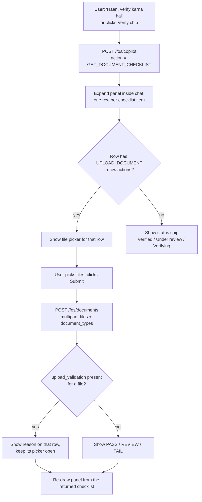

# Chatbot: when to show the document upload option

> **Short version:** Never decide from the bot's answer text. Show the upload option only when the backend
> response says so: an `UPLOAD_DOCUMENT` action, or a pending document marked `DOCUMENT_MISSING` /
> `DOCUMENT_REJECTED`.

The backend decides and the frontend only displays (see `LOS-agentic-ai/docs/APPLICANT_AGENT.md` §17).
Every response already says which documents are missing and what the user can do next. The frontend reads
those fields and draws a button. It never reads the `answer` sentence or keeps its own list of documents.

---

## 1. First, use the right API

| API | Upload signals? | Use for |
|---|---|---|
| `POST /api/v1/copilot/query` (what the chatbot calls **today**, `frontend/src/runtime/chatbot/api/client.ts` → `queryChat()`) | **No.** It returns `pending_items` as plain strings and `next_action` as a single string. No `checklist`, `actions` or `available_actions`. | General chat |
| `POST /api/v1/fos/copilot` | **Yes.** It returns all the fields below. | Document questions + the verify flow |
| `POST /api/v1/fos/documents` | Response includes a fresh `checklist` | Actually uploading files |

So the chatbot must call **`/api/v1/fos/copilot`**, at least for document questions and the verify flow.
Otherwise there is nothing reliable to decide from.

`/fos/copilot` request:

```json
{
  "applicant_id": "APP-123",
  "case_id": "CASE-456",
  "action": "CUSTOM_QUERY",          // or GET_DOCUMENT_CHECKLIST, GET_PENDING_ITEMS, ...
  "message": "mandatory documents kaun se hain?",
  "context": { }                     // echo back `context` from the previous response
}
```

---

## 2. The decision rule: show upload when ANY of these is true

Check these in order on every `/fos/copilot` response. Each one tells you *which* document to ask for.

| # | Look at | Show upload when… | Document to ask for |
|---|---|---|---|
| 1 | `actions[]` | an item has `action == "UPLOAD_DOCUMENT"` (e.g. the user said "PAN dobara upload karna hai") | `item.document_type` |
| 2 | `checklist[].actions[]` | a row's actions contain `UPLOAD_DOCUMENT` with `enabled: true` (the row's `status` is `MISSING` or `REJECTED`) | `row.slot`, allowed types in `row.accepted_types` |
| 3 | `pending_items[]` | `type == "DOCUMENT"` **and** `code` is `DOCUMENT_MISSING` or `DOCUMENT_REJECTED` | `item.slot`, allowed types in `item.accepts` |
| 4 | `next_action.action` | is `COLLECT_DOCUMENT` or `REQUEST_CORRECT_DOCUMENT` | `next_action.target` |
| 5 | `verification.documents[].next_action` | `action == "UPLOAD_DOCUMENT"` (the document's `verdict` is `FAIL` or `MISSING`) | `document_type`, `accepted_types` |
| 6 | `available_actions[]` | `UPLOAD_DOCUMENT` with `enabled: true` | none: show only a general **"Upload documents"** button |

### Do NOT show upload for these. Show a status chip instead.

| Signal | Show |
|---|---|
| `pending_items[].code == "DOCUMENT_UNDER_REVIEW"` | "Under review" |
| `pending_items[].code == "DOCUMENT_NOT_VERIFIED"` / `next_action.action == "AWAIT_VERIFICATION"` | "Verifying…" |
| `next_action.action == "RESOLVE_DOCUMENT_REVIEW"` | "Waiting for reviewer" |
| `checklist[].fulfilment == "SATISFIED"` | ✔ Done |
| `next_action.action == "SUBMIT_TO_CPA"` | "All documents done, ready for CPA" |

> **Why check all six?** For free-text questions the backend **removes** fields that don't belong to the
> question's intent. For example, a "pending items" question keeps only `pending_items` + `next_action`, and has
> no `checklist`. So check every signal and use whichever ones are present.

---

## 3. What each kind of question returns

| User asks | Backend `intent` | Field that drives upload |
|---|---|---|
| "Mandatory documents ki list do" | `DOCUMENTS_REQUIRED` | `checklist[]` (signal 2) |
| "Kaun se documents pending hain?" | `PENDING_ITEMS` / `DOCUMENTS_MISSING` / `DOCUMENTS_PENDING` | `pending_items[]` (signal 3) |
| "Next kya karna hai?" (the agent says PAN is missing) | `NEXT_ACTION` | `next_action` (signal 4) |
| "Mera PAN reject hua, dobara upload karna hai" | `MARK_FOR_REUPLOAD` / upload request | `actions[]` (signal 1) |
| "Documents verify hue?" | `DOCUMENT_VERIFICATION` | `verification.documents[]` (signal 5) |
| "Haan, mujhe verify karna hai" | anything | Start the **Verify flow** (section 4) |

---

## 4. The "Yes, I want to verify" flow



Steps:

1. **Open.** Call `/fos/copilot` with `"action": "GET_DOCUMENT_CHECKLIST"`. A button action like this returns the
   full response, nothing removed.
2. **Expand.** Draw one row per `checklist[]` item: `label`, `required`, `status`.
   - The row has `UPLOAD_DOCUMENT` in `row.actions`: show a file picker.
     `accept=".pdf,.jpg,.jpeg,.png,.bmp,.tif,.tiff,.webp"`.
   - `row.accepts_any_one_of == true` (e.g. `ADDRESS_PROOF` takes DL / Passport / Voter ID): add a small
     dropdown of `row.accepted_types`, or leave it blank and let the backend detect the type.
   - Anything else: a status chip.
3. **Submit.** Send **one** multipart `POST /api/v1/fos/documents` for all the picked files (example below).
4. **Show results** from `verification.documents_processed[]`:
   - `verification`: `PASS` (green), `REVIEW` (amber), `FAIL` (red).
   - If `upload_validation` is present, the file was rejected. Show `upload_validation.reason`
     (`WRONG_DOCUMENT` / `INVALID_UPLOAD`) or `code` (`FILE_TOO_LARGE`, `UNSUPPORTED_FILE_TYPE`, …), and keep that
     row's picker open.
   - `response_type == "UPLOAD_VALIDATION"`: at least one file was rejected. `"UPLOAD_RESULT"`: all were accepted.
5. **Refresh.** The upload response already contains a fresh `checklist`, `pending_items` and `next_action`.
   Re-draw the panel from it. No second call is needed.

---

## 5. Upload API quick reference: `POST /api/v1/fos/documents`

`multipart/form-data`:

| Field | Required | Notes |
|---|---|---|
| `applicant_id` | yes | |
| `case_id` | yes | |
| `files` | yes (1 or more) | Repeat the field once per file |
| `document_types` | no | Matched by position: the 1st type goes with the 1st file. Blank means "detect it". Don't send more types than files. |

```ts
const form = new FormData()
form.append('applicant_id', applicantId)
form.append('case_id', caseId)
picked.forEach(({ file, type }) => {
  form.append('files', file)
  form.append('document_types', type ?? '')   // keep the positions aligned
})
await fetch('/api/v1/fos/documents', {
  method: 'POST',
  headers: { Authorization: `Bearer ${accessToken}` },   // do NOT set Content-Type
  body: form,
})
```

- **Document types:** `PAN, AADHAAR, DRIVING_LICENCE, PASSPORT, VOTER_ID, BANK_STATEMENT, SALARY_SLIP, ITR,
  FORM_16, EMPLOYMENT_PROOF, PHOTO, SIGNATURE`, plus the slot `ADDRESS_PROOF`. Take them from the checklist, not
  from a hardcoded list.
- **Files:** pdf / jpg / jpeg / png / bmp / tif / tiff / webp, **max 25 MB each**.
- **Token scope:** needs `upload_document`, or you get 403 `INSUFFICIENT_SCOPE`. If you can, hide the button when
  `user.scopes` lacks it.
- **Errors:**

  | Status | Code | Meaning |
  |---|---|---|
  | 422 | `FILE_REQUIRED` | No files sent |
  | 422 | `UNSUPPORTED_DOCUMENT_TYPE` | Unknown type. The response lists the `supported` types. |
  | 422 | `DOCUMENT_TYPES_MISALIGNED` | More types than files |
  | 400 | `EMPTY_FILE` | Every file is empty |
  | 403 | `CASE_NOT_ACCESSIBLE` | This case doesn't belong to the caller |

  Problems with a single file are **not** HTTP errors. They come back inside
  `verification.documents_processed[i].upload_validation`.

---

## 6. Pseudo-code: one function decides everything

```ts
type UploadTarget = { slot: string; acceptedTypes: string[]; reason: string }

const UPLOAD_CODES = ['DOCUMENT_MISSING', 'DOCUMENT_REJECTED']
const UPLOAD_NEXT = ['COLLECT_DOCUMENT', 'REQUEST_CORRECT_DOCUMENT']

export function getUploadTargets(r: FosResponse) {
  const out = new Map<string, UploadTarget>()
  const add = (slot?: string, types?: string[], reason = '') =>
    slot && !out.has(slot) && out.set(slot, { slot, acceptedTypes: types?.length ? types : [slot], reason })

  r.actions?.forEach(a => a.action === 'UPLOAD_DOCUMENT' && add(a.document_type, a.accepted_types, 'requested'))
  r.checklist?.forEach(row => row.actions?.some(a => a.action === 'UPLOAD_DOCUMENT' && a.enabled)
    && add(row.slot, row.accepted_types ?? row.accepts, row.status))
  r.pending_items?.forEach(p => p.type === 'DOCUMENT' && UPLOAD_CODES.includes(p.code)
    && add(p.slot, p.accepts, p.code))
  if (r.next_action && UPLOAD_NEXT.includes(r.next_action.action))
    add(r.next_action.target, undefined, r.next_action.action)
  r.verification?.documents?.forEach(d => d.next_action?.action === 'UPLOAD_DOCUMENT'
    && add(d.document_type, d.next_action.accepted_types, d.verdict))

  const showGeneralUpload =
    r.available_actions?.some(a => a.action === 'UPLOAD_DOCUMENT' && a.enabled) ?? false

  return { targets: [...out.values()], showGeneralUpload }
}
```

How to use it in the chat bubble:

- `targets.length > 0`: show an **"Upload pending documents (N)"** button under the answer. Clicking it opens
  the Verify panel with those rows.
- `targets` is empty but `showGeneralUpload` is true: show a plain **"Upload documents"** button.
- Both are empty: no upload button. Show the status chips only.

---

## 7. Don'ts

- ❌ Don't decide from `answer` text (e.g. `answer.includes('missing')`). The wording changes and the language may be Hindi.
- ❌ Don't hardcode the mandatory list. The checklist depends on the product and the policy.
- ❌ Don't recompute readiness, pending items or next action. They arrive already computed.
- ⚠️ Known backend bug: the backend never sends a `HANDOFF_TO_CPA` action in `available_actions`.
  `LOS-agentic-ai/app/agents/applicant/frontend.py:224` checks `readiness.status == "READY"`, but the backend
  returns `"READY_FOR_CPA"`. Until that's fixed, use `readiness.status == "READY_FOR_CPA"` to show "Send to CPA".

---

### Source references (backend)

- Upload route: `LOS-agentic-ai/app/api/routes/fos_api.py` (`post_documents`, `_copilot_upload`)
- Checklist / pending items / next action: `LOS-agentic-ai/app/agents/applicant/workflow.py`
- `checklist_row`, `next_step`: `LOS-agentic-ai/app/agents/applicant/copilot/answering/structured.py`
- `available_actions`, `case_state`: `LOS-agentic-ai/app/agents/applicant/frontend.py`
- Document types: `LOS-agentic-ai/app/config/applicant_agent.yaml`
