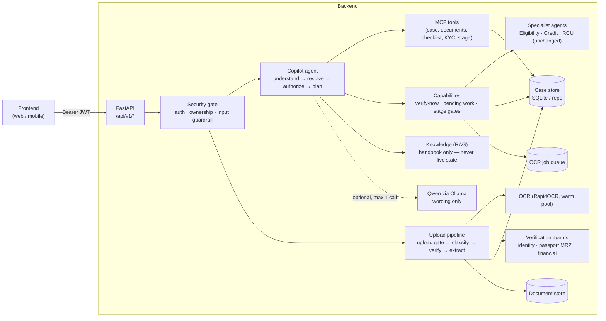
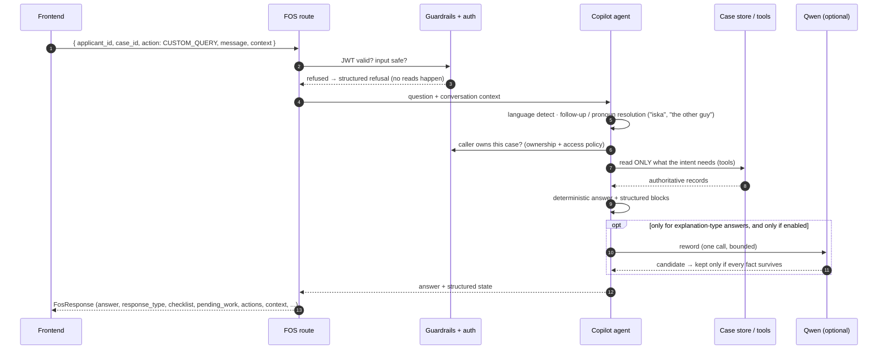
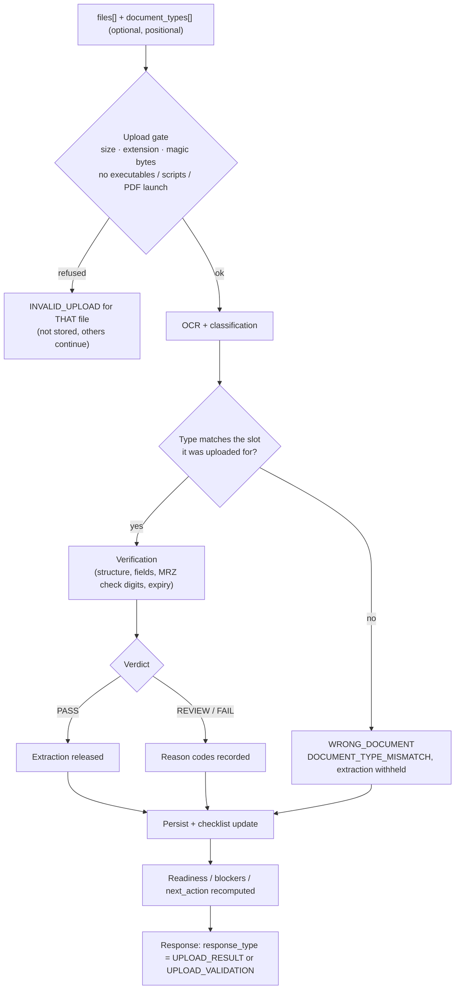
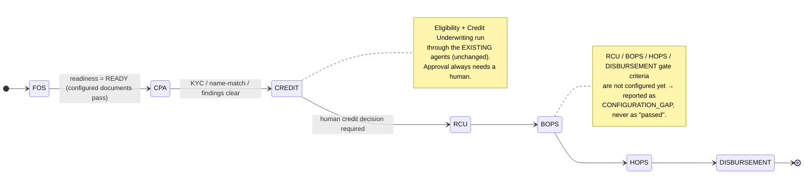
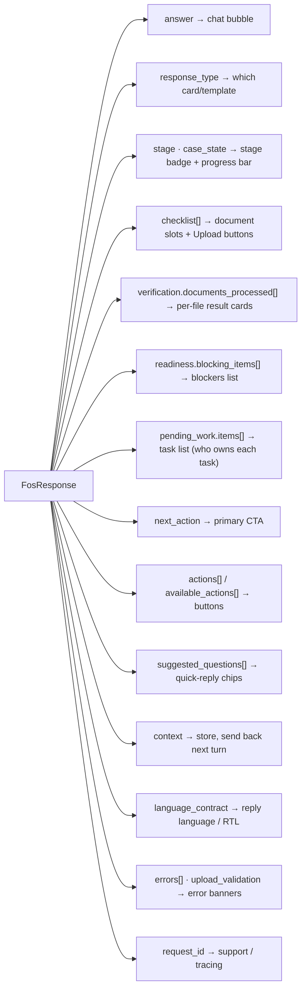
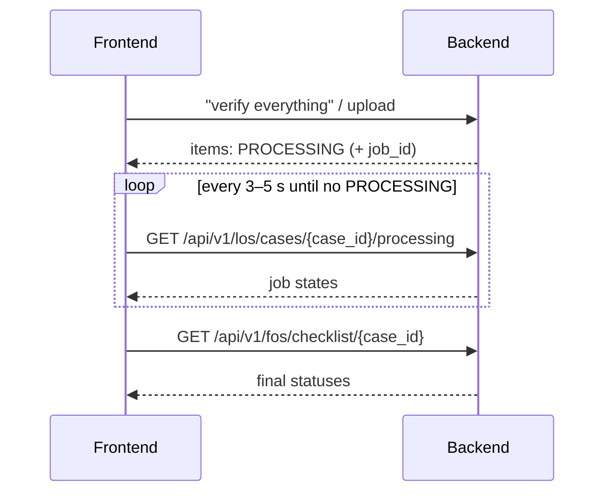
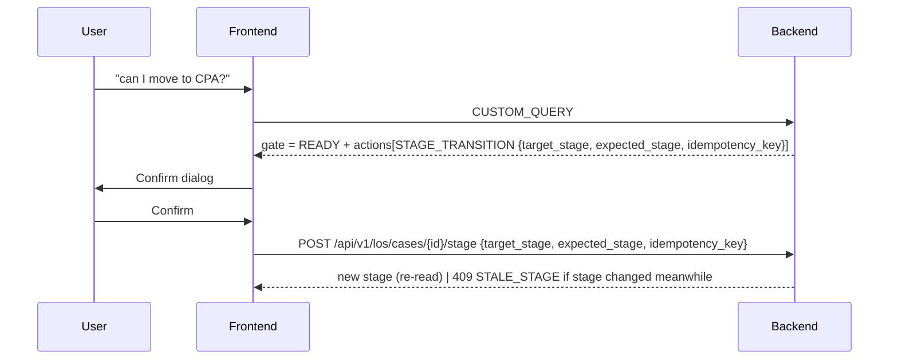
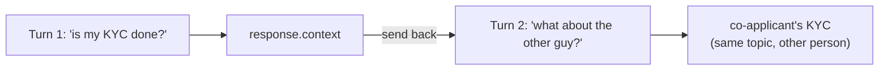

# LOS Agentic AI — How the Backend Works & How to Integrate a Frontend

This guide explains, with diagrams, what happens inside the backend when the
frontend calls it, and exactly which response fields a UI should render.

> **Golden rule for the frontend:** never parse the `answer` text to learn
> state. Every state the UI shows (stage, documents, blockers, pending work,
> actions, processing, errors) comes as **structured fields**. `answer` is only
> the sentence you show in the chat bubble.

---

## 1. The big picture



| Layer | Source of truth? | Notes |
|---|---|---|
| Case store, verification, KYC, eligibility, credit, stage | **Yes** | Deterministic services. Every fact in an answer comes from here. |
| Knowledge / RAG | No | Explains *how the process works* ("what is KYC?"). Never answers "what is *my* status". |
| Qwen (Ollama) | No | Optional rewording / explanation, behind a fidelity check. Off for live facts. |

---

## 2. What happens on one chat message

`POST /api/v1/fos/copilot` with `action: "CUSTOM_QUERY"`:



**Key points**
- The security decision happens **before** any read, tool, RAG or model call.
- Conversation memory travels in `context` — send back the `context` you
  received on the next turn so follow-ups ("and the co-applicant?", "haan")
  work.
- Compound questions ("loan amount aur pending documents?") are split and
  answered part by part.

---

## 3. What happens on a document upload

`POST /api/v1/fos/copilot` as `multipart/form-data`, `action=UPLOAD_DOCUMENT`:



- **One bad file never stops the others** — each file gets its own entry in
  `verification.documents_processed`.
- A long scan may be **queued**: its card shows `PROCESSING` with a job id,
  and the durable OCR queue finishes it later (poll, see §6.6).
- `PASS` means *structurally valid and internally consistent* — **not**
  "genuine". `authenticity: "NOT_ESTABLISHED"` and `issuer_verified: false`
  are reported until an issuer/authenticity provider is configured.

---

## 4. The loan stage lifecycle



- Gate criteria live in `app/config/stage_gates.yaml` (marked **UNCONFIRMED**
  until business sign-off). Order comes from the workflow configuration.
- The copilot **never moves a stage itself**. When asked "move it ahead", it
  returns a `STAGE_TRANSITION` action; the frontend shows a confirmation and
  calls the stage endpoint (§6.7) with `expected_stage` + `idempotency_key`.

---

## 5. Endpoints a frontend uses

| Purpose | Method & path | Body |
|---|---|---|
| Login (dev identity provider) | `POST /api/v1/auth/login` | `{username, password}` → `{access_token, refresh_token, token_type, expires_in}` |
| Refresh token | `POST /api/v1/auth/refresh` | `{refresh_token}` → new token pair |
| Open a case (new or existing applicant) | `POST /api/v1/fos/applicants` | `{applicant:{...}, application:{product, loan_amount, tenure_months, ...}, applicant_id?}` |
| Dropdown actions (render from data) | `GET /api/v1/fos/actions` | — |
| **Copilot: chat + actions** | `POST /api/v1/fos/copilot` | JSON `{applicant_id, case_id, action, message?, context?}` |
| **Copilot: upload** | `POST /api/v1/fos/copilot` | multipart `applicant_id, case_id, action=UPLOAD_DOCUMENT, files[], document_types[]` |
| Checklist with per-slot upload buttons | `GET /api/v1/fos/checklist/{case_id}` | — |
| Documents of a case | `GET /api/v1/fos/documents/{case_id}` | — |
| Application status | `GET /api/v1/fos/applications/{case_id}` | — |
| Background processing (jobs) | `GET /api/v1/los/cases/{case_id}/processing` | — |
| Stage transition (after user confirms) | `POST /api/v1/los/cases/{case_id}/stage` | `{target_stage, expected_stage, idempotency_key, reason, ...}` |
| Universal copilot (all stages) | `POST /api/v1/copilot/query` | `{message, case_id, applicant_id, conversation_id, context, ...}` |
| Standalone verifiers | `POST /api/v1/verify`, `POST /api/v1/financial/verify` | multipart `file` (+ `expected_type`) |
| Health | `GET /health`, `GET /ready` | — |

Swagger UI: `{BASE_URL}/docs`. All business endpoints need
`Authorization: Bearer <access_token>`.

`action` values for `/fos/copilot`: `GET_APPLICANT`, `GET_APPLICATION_STATUS`,
`GET_DOCUMENTS`, `GET_DOCUMENT_CHECKLIST`, `GET_VERIFICATION_STATUS`,
`GET_PENDING_ITEMS`, `GET_NEXT_ACTION`, `GET_CASE_360`, `CHECK_CPA_READINESS`,
`UPLOAD_DOCUMENT`, `CUSTOM_QUERY`. Prefer loading them from
`GET /api/v1/fos/actions` (each has `label`, `requires_message`,
`requires_file`, `content_type`).

---

## 6. Rendering the response

### 6.1 Which field drives which UI element



| UI need | Field | Example values |
|---|---|---|
| What kind of reply | `response_type` | `UPLOAD_RESULT`, `UPLOAD_VALIDATION`, `DOCUMENT_VERIFICATION_RESULT`, ... |
| Current stage | `stage`, `case_state.stage` | `BASIC_DOCUMENT_VERIFICATION` |
| Progress | `case_state` | `documents_required: 3, documents_satisfied: 2, collection_progress: 67` |
| Document slots | `checklist[]` | `{slot, label, status, required, accepted_types, actions:[UPLOAD_DOCUMENT]}` |
| Per-file outcome | `verification.documents_processed[]` | `verification: PASS/REVIEW/FAIL`, `reason_codes`, `authenticity` |
| Blockers | `readiness.status`, `readiness.blocking_items[]` | `NOT_READY`, `{code: DOCUMENT_MISSING, slot: ADDRESS_PROOF}` |
| Work list | `pending_work.items[]` | `owner: COMPLETED / PROCESSING / SYSTEM / USER / REVIEWER`, `executable` |
| Primary next step | `next_action` | `{action: COLLECT_DOCUMENT, target: ADDRESS_PROOF, detail}` |
| Buttons | `actions[]`, `available_actions[]` | `STAGE_TRANSITION`, `UPLOAD_DOCUMENT`, `enabled` |
| Who it is about | `subject` | `{party: PRIMARY_APPLICANT / CO_APPLICANT / BOTH}` |
| Stage gate | `gate` | `READY / BLOCKED / CONFIGURATION_GAP` per check |
| Several cases | `portfolio` | the applicant's cases (latest / previous / needing attention) |
| Language | `language_contract` | `response_language`, `reply_language`, `localized` |
| Tracing | `request_id` | `fos_8239fb4c...` |

### 6.2 Status semantics — never merge these

| Value | Meaning | UI |
|---|---|---|
| `PASS` | Verified (structure + fields). **Not** "genuine". | green tick |
| `REVIEW` | Read, but a person must decide | amber, "with reviewer" |
| `FAIL` | Wrong / unreadable / invalid | red, show reason + re-upload |
| `PROCESSING` | Still running in background | spinner, poll |
| `MISSING` | Slot not uploaded | Upload button |
| `CONFIGURATION_GAP` | Business rule not configured yet | grey, "pending configuration" |

### 6.3 Real example — checklist slot with its own upload button

```json
{
  "slot": "BANK_STATEMENT",
  "label": "Bank Statement",
  "status": "MISSING",
  "required": true,
  "accepted_types": ["BANK_STATEMENT"],
  "actions": [
    { "action": "UPLOAD_DOCUMENT", "document_type": "BANK_STATEMENT",
      "accepted_types": ["BANK_STATEMENT"], "enabled": true }
  ]
}
```

Render one row per slot; the Upload button uploads **only** the types in its
`accepted_types`. Send the slot's `document_type` in `document_types[]`.

### 6.4 Real example — per-file verification card

```json
{
  "source_id": "pan.jpg",
  "document_type": "PAN",
  "expected_type": "PAN",
  "verification": "PASS",
  "status": "SUCCESS",
  "reason_codes": [],
  "extraction_released": true,
  "authenticity": "NOT_ESTABLISHED",
  "verification_scope": "DOCUMENT_STRUCTURE_AND_FIELD_CONSISTENCY",
  "issuer_verified": false
}
```

### 6.5 Real example — blockers and next step

```json
"readiness": {
  "status": "NOT_READY",
  "blocking_count": 2,
  "blocking_items": [
    { "type": "DOCUMENT", "code": "DOCUMENT_MISSING", "slot": "ADDRESS_PROOF",
      "detail": "Address Proof has not been uploaded." },
    { "type": "DOCUMENT", "code": "DOCUMENT_MISSING", "slot": "BANK_STATEMENT",
      "detail": "Bank Statement has not been uploaded." }
  ]
},
"next_action": { "action": "COLLECT_DOCUMENT", "target": "ADDRESS_PROOF",
                 "detail": "Collect and upload the missing document: Address Proof." }
```

### 6.6 Long-running work (polling)

There is **no streaming (SSE/WebSocket)** yet. When a document is still being
read, its item shows `PROCESSING` with a job id. Poll:



Never show "done" while an item is `PROCESSING`.

### 6.7 Moving a stage (human confirmation)



`expected_stage` protects against stale screens; `idempotency_key` makes a
double-click safe. Requires the stage-write scope.

### 6.8 Errors

| Situation | What you get |
|---|---|
| No / bad token | `401 {"detail": "..."}` |
| Not your case | `403 {"detail": {"code": "CASE_ACCESS_DENIED", "message": "...", "request_id": "..."}}` |
| Bad file in an upload | `200`, that file's card has `INVALID_UPLOAD` / `WRONG_DOCUMENT` in `upload_validation`; other files processed |
| Question not understood | `200`, `clarification_required {question, options[]}` → render options as chips; `errors: [{code: UNSUPPORTED_REQUEST}]` |
| Unsafe request | `200`, `intent: GUARDRAIL_BLOCKED`, polite refusal, nothing read |

**HTTP 200 does not always mean "answered"** — check `errors[]` and
`clarification_required`.

---

## 7. Conversation & languages



- Always send back the last `context` object (or `conversation_id` on the
  universal route).
- Supported input: English, Hindi, Hinglish, Marathi (incl. Roman), Bengali,
  Tamil, Telugu, Gujarati, Kannada, Malayalam, Punjabi, Urdu, Nepali and more.
- `language_contract.reply_language` tells you the language the `answer` is
  actually in. If a template does not exist for a fact, the answer stays in
  English and `localized: false` — show it as is (set `dir="rtl"` for Urdu).
- Numbers, names, IDs, statuses never change with language.

---

## 8. Minimal TypeScript client

```ts
const BASE = import.meta.env.VITE_LOS_API;          // e.g. http://127.0.0.1:8765

async function login(username: string, password: string) {
  const r = await fetch(`${BASE}/api/v1/auth/login`, {
    method: "POST", headers: { "Content-Type": "application/json" },
    body: JSON.stringify({ username, password }),
  });
  if (!r.ok) throw new Error("login failed");
  return (await r.json()) as { access_token: string; refresh_token: string; expires_in: number };
}

let lastContext: unknown = null;                     // conversation memory

async function ask(token: string, applicantId: string, caseId: string, message: string) {
  const r = await fetch(`${BASE}/api/v1/fos/copilot`, {
    method: "POST",
    headers: { "Content-Type": "application/json", Authorization: `Bearer ${token}` },
    body: JSON.stringify({ applicant_id: applicantId, case_id: caseId,
                           action: "CUSTOM_QUERY", message, context: lastContext }),
  });
  const body = await r.json();
  if (!r.ok) throw body;                              // 401 / 403 structured detail
  lastContext = body.context ?? lastContext;
  return body;                                        // render from structured fields
}

async function upload(token: string, applicantId: string, caseId: string,
                      files: File[], types: string[]) {
  const form = new FormData();
  form.append("applicant_id", applicantId);
  form.append("case_id", caseId);
  form.append("action", "UPLOAD_DOCUMENT");
  files.forEach((f) => form.append("files", f));
  types.forEach((t) => form.append("document_types", t));   // positional, one per file
  const r = await fetch(`${BASE}/api/v1/fos/copilot`, {
    method: "POST", headers: { Authorization: `Bearer ${token}` }, body: form,
  });
  return r.json();     // verification.documents_processed[], checklist[], readiness, next_action
}

async function moveStage(token: string, caseId: string,
                         a: { target_stage: string; expected_stage: string; idempotency_key: string }) {
  const r = await fetch(`${BASE}/api/v1/los/cases/${caseId}/stage`, {
    method: "POST",
    headers: { "Content-Type": "application/json", Authorization: `Bearer ${token}` },
    body: JSON.stringify({ ...a, reason: "Confirmed by user in copilot" }),
  });
  if (r.status === 409) throw new Error("Stage changed meanwhile — refresh");
  return r.json();
}
```

---

## 9. Running locally

```bash
# 1. dev identity provider (JWKS on :8020) — development only
ENVIRONMENT=development AUTH_CLIENT_SECRET=<random> python auth_provider_dev.py

# 2. API
ENVIRONMENT=development \
JWT_JWKS_URL=http://127.0.0.1:8020/.well-known/jwks.json \
JWT_ISSUER=los-local JWT_AUDIENCE=los-agentic-ai \
python -m uvicorn main:app --host 127.0.0.1 --port 8765

# 3. open http://127.0.0.1:8765/docs
```

Optional model features (off by default, measured as not improving answers on
CPU — see the latest validation report): `CHATBOT_NATURAL_COMPOSITION=true`,
`COPILOT_UNDERSTANDING_LLM=true`, `OLLAMA_MODEL=qwen2.5:3b`.

---

## 10. Measured performance (local CPU, quiet machine)

| Operation | Typical |
|---|---|
| Chat / follow-up / action / multilingual | 40–50 ms (P95 < 110 ms) |
| Upload PAN / Driving Licence | ~1.1 s / ~1.9 s (first request after start: ~2.5 s / ~3.9 s) |
| Whole FOS document set in one request | ~2.3 s |
| Bank statement / salary slip / ITR verify | 35 ms / 9 ms / ~190 ms |
| Knowledge answer with Qwen | ~2.3 s |

Timings degrade when endpoint-security software or other heavy processes are
active on the same machine.


