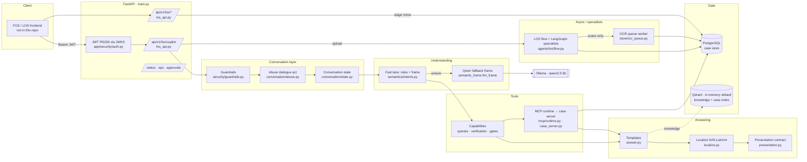

# LOS Agentic AI — Final Architecture (as built)

**Status:** verified against the code on 2026-10-07 (branch `dev/rishabh`, HEAD `b67fb55` + uncommitted Phase 3 steps 1–4).
**Scope:** what actually runs. Every claim cites a file. Anything not proven in code is marked **UNVERIFIED**.
**Supersedes:** `samples/documents/LOS_Agentic_AI_Architecture_FINAL_.pdf` (a target-state picture; section 10 lists what in it is not built).
**Diagram:** `docs/architecture_final.drawio` (5 pages).

Status words used throughout:
- **ACTIVE** — called in the live request path (caller named).
- **CONDITIONAL** — runs only behind a flag/config (flag and default named).
- **UNUSED** — defined but not in the live path (test-only, demo-only or config-only).
- **PLANNED** — agreed in the Phase 2 plan, not built yet.

---

## 1. One-page summary

**What it does.** A loan-origination backend for the **FOS** (field officer) stage and the hand-off onward: officers upload
applicant documents, the system classifies, extracts and verifies them, cross-checks identity (**KYC**), tracks the case
through the LOS stages (FOS → CPA → CREDIT → RCU → BOPS → HOPS → DISBURSEMENT), and a **chat copilot** answers questions
about the case in English, Hindi, Hinglish and Marathi.

**Stack.** Python **FastAPI** (`main.py`, port 8010) · **PostgreSQL** via psycopg pool (`app/store/postgres_repo.py`;
dev: embedded `pgserver` under `runtime/pgdata`, `app/store/__init__.py:_embedded_dsn`) · **Qwen 2.5-3B** in **Ollama** on
CPU (`.env` `OLLAMA_MODEL=qwen2.5:3b`) · **RapidOCR** (ONNX) + Tesseract (`app/agents/document_agent/ocr.py`) ·
**LangGraph** for specialist orchestration (`app/orchestration/graph.py`) · **MCP** Python SDK for case tools
(`app/mcp/runtime.py`, `app/mcp/case_server.py`) · **Qdrant** client (in-memory by default, `app/knowledge/vector_store.py`).

**Key design decisions.**
1. **Deterministic fast lane first.** Rules + semantic frame answer most questions in **~20 ms** with no model
   (`copilot/semantics/intents.py:understand`). Qwen is a **fallback** only when rules are unsure
   (`agent.py:1153` → `semantic_frame.llm_frame`). A JSON-mode Qwen **router** is PLANNED (step 6; benchmarked in step 1).
2. **Guardrail before anything else.** `guardrails.check_input` runs before conversation state, before any read and
   before any model (`agent.py:_conversational`, line 2532). A model never decides authorization.
3. **Facts come from the store, words may come from the model.** Answers are templates over DB values
   (`answering/answer.py`); optional Qwen rewording is fidelity-checked and discarded if any fact changes
   (`answering/composer.py:fidelity`).
4. **Fail-closed stage gate** (Phase 3, CONDITIONAL): the FOS → CPA gate is enforced **inside**
   `stage_lifecycle.transition()`; unresolved stage or unreadable gate = refuse (`LOS_STAGE_GATE_IN_SERVICE`, default off).
5. **CPU-only box.** 16 GB RAM, no GPU: one Qwen model held (1.92 GB), bounded OCR workers, background OCR for scans
   only, memory guard on benchmarks (`evals/perf/memguard.py`).

---

## 2. High-level architecture



---

## 3. Request flows

### 3a. Chat message

```mermaid
sequenceDiagram
  autonumber
  participant U as Frontend
  participant R as fos_api.copilot
  participant A as agent._conversational
  participant G as guardrails.check_input
  participant S as conversation state
  participant I as intents.understand (fast lane)
  participant Q as Qwen (Ollama)
  participant T as _call_tools → MCP
  participant DB as PostgreSQL
  participant P as answer → localize → presentation
  U->>R: POST /api/v1/fos/copilot (JWT, applicant_id, case_id, message)
  R->>R: require_jwt; (no case_id → case_pick, flag COPILOT_SINGLE_CASE_RESOLVE)
  R->>A: _copilot_json → _run_action → _answer_action
  A->>G: screen input (injection, other customers, secrets)
  alt refused
    G-->>U: refusal, zero reads, zero tools
  end
  A->>A: abuse.classify (abuse only → boundary reply, zero reads)
  A->>S: read_turn (pending yes/no, correction, follow-up, expiry)
  alt answered from state (yes/no, cancel, re-ask)
    S-->>U: reply; confirmed action → actions.execute (authorized write + read-back)
  end
  A->>I: understand(message) — rules, semantic frame, examples
  opt rules unsure (UNKNOWN / low confidence)
    I->>Q: llm_frame: JSON, temperature 0, 64 tokens, 1.5 s timeout
    Q-->>I: frame JSON → validate_llm_frame (closed schema) or ignored
  end
  A->>T: authorize (access.authorize) then read tools
  T->>DB: SQL (parameterised) via repository
  DB-->>T: rows
  T-->>A: tool envelopes (+ MCP trace)
  A->>P: template answer from facts → optional composer (flag) → localize
  P-->>R: answer + presentation (+ document_actions, flag)
  R->>R: attention.amend (open reviews) · mask_payload (PII)
  R-->>U: JSON response (streaming PLANNED, step 7)
```

Stage-by-stage, with evidence:

| # | Stage | Where | Status |
|---|---|---|---|
| 1 | HTTP entry, JWT | `app/api/routes/fos_api.py:copilot` (1048), `app/security/auth.py` (RS256, JWKS `JWT_JWKS_URL`) | ACTIVE |
| 2 | No case id → pick the case | `fos_api.py:_copilot_json` → `copilot/capabilities/case_pick.py:resolve` | CONDITIONAL `COPILOT_SINGLE_CASE_RESOLVE` (off) · Phase 3 |
| 3 | Input guardrail | `app/security/guardrails.py:check_input` (282), called `agent.py:2532` | ACTIVE |
| 4 | Abuse dialogue act | `copilot/conversation/abuse.py:classify`, called in `agent.py:_conversational` | ACTIVE |
| 5 | Conversation memory (labels only, TTL 1800 s) | `conversation/state.py:read_turn` (1188), `RepositoryConversationStore` (760), table `conversation_state` | ACTIVE |
| 6 | Typed confirmation of a proposed action | `conversation/state.py:_action_turn`, `conversation/actions.py:execute` (107) | ACTIVE (RAISE_QUERY only) |
| 7 | Fast lane understanding | `copilot/semantics/intents.py:understand` (1805), `classify` (1389) | ACTIVE |
| 8 | Lending-term definitions → knowledge | `copilot/semantics/terms.py:is_definition`, hook in `intents.py:classify` | CONDITIONAL `COPILOT_TERMS_KNOWLEDGE` (off) · Phase 3 |
| 9 | Qwen fallback frame | `agent.py:1153` → `semantic_frame.llm_frame` (793) → `_ollama_generate` (863, raw `/api/chat`, `format: json`) | CONDITIONAL `COPILOT_UNDERSTANDING_LLM` / `understanding.llm_fallback` (default true) + Ollama reachable |
| 10 | Authorize before retrieve | `agent.py:_authorize_capability` (2740), `app/security/access.py:authorize` | ACTIVE |
| 11 | Tool calls | `agent.py:_call_tools` (88) → `app/mcp/runtime.py:call` (290) | ACTIVE |
| 12 | MCP protocol transport | `runtime._Session` (memory/stdio/http) → `app/mcp/case_server.py:_authorise` (re-validates JWT) | CONDITIONAL `LOS_MCP_MODE=protocol` (project `.env`: unset → **in_process**) |
| 13 | Templates from facts | `copilot/answering/answer.py` | ACTIVE |
| 14 | Optional Qwen rewording | `copilot/answering/composer.py:finish` (243), `fidelity` (118) | CONDITIONAL `CHATBOT_NATURAL_COMPOSITION` (off) |
| 15 | Localization | `copilot/answering/localize.py:apply` (686), `app/config/languages.yaml` | ACTIVE |
| 16 | Localized KYC reasons | `localize.py:_reason` | CONDITIONAL `COPILOT_LOCALIZED_KYC_REASONS` (off) · Phase 3 |
| 17 | Documents-needing-action view | `copilot/answering/document_actions.py:build/render`, hook in `fos_api.copilot` | CONDITIONAL `COPILOT_DOCUMENT_ACTIONS` (off) · Phase 3 |
| 18 | Open-review amendment | `copilot/answering/attention.py:amend` | ACTIVE |
| 19 | Presentation contract | `copilot/answering/presentation.py:build` (241) | ACTIVE |
| 20 | PII masking on output | `app/security/sensitivity.py:mask_payload` (called in `fos_api.copilot`) | ACTIVE |
| 21 | Bold emphasis (`emphasis`, `answer_markdown`, clean `answer_plain`) | — | PLANNED step 5 |
| 22 | JSON Qwen router (tool choice) | `evals/perf/router_bench.py` (benchmark only) | PLANNED step 6 |
| 23 | Streaming + status events | — | PLANNED step 7 |

### 3b. Document upload → verification → KYC → findings

```mermaid
sequenceDiagram
  autonumber
  participant U as Frontend
  participant R as fos_api._copilot_upload
  participant F as flow.process_application
  participant D as Document Agent (OCR · classify · extract)
  participant V as Verification Agent
  participant S as Specialists (LangGraph run_agent)
  participant K as KYC Agent
  participant I as ingest.persist_los_result
  participant DB as PostgreSQL
  participant W as OCR queue worker
  U->>R: multipart UPLOAD_DOCUMENT (files, document_types)
  R->>F: one call for the batch (fos_api.py 1773)
  loop each document
    F->>F: _process_one — declared type routed to a specialist?
    alt SIGNATURE / SALE_DEED / BUSINESS_PROOF / BANK_SIGNATURE…
      F->>S: _run_specialist → orchestration.graph.run_agent
    else ID / financial document
      F->>D: process_document (RapidOCR, Tesseract; poppler for PDF)
      D->>V: verify (FAIL only on positive evidence; unreadable → REVIEW)
    end
  end
  F->>K: KYC after verification (FOS_KYC_ON_UPLOAD, default on)
  F->>F: eligibility (run_agent eligibility_agent) → risk (fraud_risk, deterministic)
  F->>I: persist
  I->>DB: documents, document_versions (supersede), case_findings (EXTRACTION/VERIFICATION/KYC, encrypted), case_decisions, case_events
  I->>DB: ocr_jobs (only DOCUMENT_REQUIRES_OCR / QUEUED_FOR_PROCESSING)
  W->>DB: claim job → OCR → record result (LOS_OCR_WORKER_ENABLED)
  R-->>U: per-document status + presentation
```

Evidence: `app/api/routes/fos_api.py:_copilot_upload` (1639) · `app/agents/los/flow.py:process_application` (1695),
`_process_one` (535), `_run_specialist` (370) · `app/orchestration/graph.py:run_agent` · `app/agents/verification/agent.py`,
`basic.py` · `app/agents/kyc/agent.py:run_kyc` · `app/store/ingest.py:persist_los_result` (28), OCR jobs (384) ·
`app/store/ocr_queue.py` (worker started in `main.py:383`) · `app/store/crypto.py:seal` (81) / `open_` (89).

### 3c. FOS → CPA stage transition (KYC gate + maker-checker)

```mermaid
sequenceDiagram
  autonumber
  participant U as Operator / workflow
  participant R as los_api.transition_stage
  participant G as stage_gate.evaluate_live
  participant L as stage_lifecycle.transition
  participant M as approvals (maker-checker)
  participant DB as PostgreSQL
  U->>R: POST /los/cases/{id}/stage (target, reason, mode)
  R->>R: scope + access.authorize_claims(write)
  alt mode GATED
    R->>G: FOS gate: readiness (+ KYC_COMPLETE if LOS_FOS_CPA_KYC_RULE)
    G-->>R: not PASS → 409 GATE_NOT_MET (blockers named)
  else mode OVERRIDE
    R->>R: needs override scope or los.write
    R->>M: maker-checker on → 202 PENDING_CHECK (case not moved)
    M->>L: second person approves → transition(source=MAKER_CHECKER)
  end
  R->>L: transition(...)
  L->>L: edge check (stage_lifecycle.yaml)
  opt LOS_STAGE_GATE_IN_SERVICE (Phase 3)
    L->>L: stage unresolved → 409 STAGE_UNRESOLVED (fail closed)
    L->>G: gate again (service-level) → error → 503 GATE_UNAVAILABLE
    L->>L: only MAKER_CHECKER skips; reason "OVERRIDE: …" + audit
  end
  L->>DB: apply_stage_transition (case_stage + stage_transitions + case_events, one txn, advisory lock)
  R-->>U: new stage, history, gate view
```

Evidence: `app/api/routes/los_api.py:transition_stage` (749) · `app/agents/los/stage_gate.py:evaluate_live` (24) →
`copilot/capabilities/gates.py:read_sources/evaluate` · `app/config/stage_gates.yaml` · `app/agents/los/stage_lifecycle.py:transition`,
`_enforce_gate` · `app/agents/los/kyc_gate.py:evaluate` · `app/approvals/service.py:_run_stage_override` (103) ·
`app/api/routes/approvals_api.py` (78 decision) · `app/store/sql_repo.py:apply_stage_transition` (1250).
Entering **CREDIT** starts credit underwriting when the caller holds the underwriting scope (`los_api.py:_start_credit_underwriting`, 900).

---

## 4. Component table

| Component | Purpose | file:function | Status | Flag (default) | Measured |
|---|---|---|---|---|---|
| FastAPI app | HTTP API, routers, error contract | `main.py`, `app/api/errors.py:install` | ACTIVE | — | — |
| JWT auth | RS256 tokens, keys from JWKS | `app/security/auth.py` (`require_jwt`) | ACTIVE | `JWT_JWKS_URL` | — |
| Login rate limiter | throttles local login only | `app/security/credential_store.py:LoginRateLimiter`, `auth_api.py` | ACTIVE (login only) | — | — |
| Ownership / scopes | case & applicant grants, write scopes | `app/security/access.py:authorize`, table `access_grants` | ACTIVE | — | — |
| Input/output guardrails | injection, cross-customer, secrets | `app/security/guardrails.py:check_input/check_output` | ACTIVE | — | — |
| PII masking | masks PAN/Aadhaar/account in output, logs, model context | `app/security/sensitivity.py` | ACTIVE | — | — |
| Audit log | every tool/write recorded | `app/agents/applicant/audit.py:record` | ACTIVE | — | — |
| Copilot agent | conversation + answer pipeline | `app/agents/applicant/copilot/agent.py:_conversational` | ACTIVE | — | fast lane p50 **~20 ms** |
| Abuse dialogue act | profanity → boundary / remainder | `copilot/conversation/abuse.py` | ACTIVE | — | — |
| Conversation state | follow-ups, yes/no, corrections | `copilot/conversation/state.py` | ACTIVE | — | — |
| Typed action confirmation | "haan kar do" executes proposed RAISE_QUERY | `copilot/conversation/actions.py` | ACTIVE | — | — |
| Fast-lane intents | rules, semantic frame, examples | `copilot/semantics/intents.py`, `semantic_frame.py` | ACTIVE | — | — |
| Qwen intent fallback | proposes a frame when rules unsure | `semantic_frame.py:llm_frame` | CONDITIONAL | `COPILOT_UNDERSTANDING_LLM` (on via config) | 1.5 s timeout |
| Qwen answer rewording | style only, fidelity-guarded | `answering/composer.py` | CONDITIONAL | `CHATBOT_NATURAL_COMPOSITION` (off) | — |
| Applicant answer LLM | Qwen phrasing of some intents | `answering/answer.py` (~734) | CONDITIONAL | `APPLICANT_AGENT_LLM_ENABLED` (.env true), simple intents off | — |
| Knowledge answers | FOS handbook Q&A (OKF markdown) | `app/agents/applicant/knowledge_answer.py`, `knowledge/fos/*.md` | ACTIVE (phrasing CONDITIONAL on Ollama) | — | — |
| Capabilities | queries, verify, stage gate, work | `copilot/capabilities/*.py` | ACTIVE | — | — |
| MCP runtime | traced tool calls; in-process or protocol | `app/mcp/runtime.py:call` | ACTIVE (transport CONDITIONAL) | `LOS_MCP_MODE` (project .env: unset → in_process) | — |
| MCP case server | 11 read tools, JWT re-validated, no writes | `app/mcp/case_server.py` | CONDITIONAL (protocol mode) | `LOS_MCP_MODE=protocol` | live: authorized, caller = token subject |
| LOS flow | batch document processing | `app/agents/los/flow.py:process_application` | ACTIVE | — | — |
| Orchestrator (LangGraph) | runs specialist agents with breaker/bulkhead | `app/orchestration/graph.py:run_agent` | ACTIVE | per-agent `enabled` in `agents.yaml` | — |
| Document Agent | OCR, classify, extract | `app/agents/document_agent/workflow.py`, `ocr.py` (RapidOCR) | ACTIVE | — | OCR workers default 3 |
| Verification Agent | verdict per document | `app/agents/verification/agent.py`, `basic.py` | ACTIVE | `VERIFICATION_ENABLED*` (.env true) | — |
| Specialists | signature, sale deed, business evidence, bank statement | `agents/signature`, `agents/sale_deed`, `agents/business_evidence`, `agents/bank_statement` via `run_agent` | ACTIVE | `agents.yaml` enabled | sale deed 2.5–5.5 s |
| KYC Agent | cross-document identity checks | `app/agents/kyc/agent.py:run_kyc`, `app/config/kyc_policies.yaml` | ACTIVE | `FOS_KYC_ON_UPLOAD` (true) | — |
| Eligibility Agent | FOIR, income, policy rules | `app/agents/eligibility/*`, via `flow.py:1598 run_agent` | ACTIVE | `agents.yaml` enabled | — |
| Fraud/risk Agent | deterministic risk signals (LLM summary on own route only) | `app/agents/fraud_risk/agent.py`, `flow.py:_risk_for` | ACTIVE | `FRAUD_RISK_AGENT_ENABLED` (true) | — |
| Credit underwriting | assessment on entering CREDIT (LangGraph) | `app/agents/credit/*`, `los_api.py:_start_credit_underwriting` | ACTIVE | caller scope | — |
| Stage lifecycle | the only stage writer | `app/agents/los/stage_lifecycle.py:transition` | ACTIVE | — | — |
| Stage gates | gate checks per stage | `app/config/stage_gates.yaml`, `capabilities/gates.py`, `los/stage_gate.py` | ACTIVE | — | — |
| Service-level fail-closed gate | gate inside `transition()` | `stage_lifecycle.py:_enforce_gate` | CONDITIONAL · Phase 3 | `LOS_STAGE_GATE_IN_SERVICE` (off) | impact: 0/178 unresolved |
| KYC rule for CPA | all `cpa_gate` checks PASS, every party | `app/agents/los/kyc_gate.py`, `kyc_policies.yaml cpa_gate` | CONDITIONAL · Phase 3 | `LOS_FOS_CPA_KYC_RULE` (off) | — |
| Maker-checker | four-eyes for overrides | `app/approvals/service.py`, `approvals_api.py`, `maker_checker.yaml` | ACTIVE | `MAKER_CHECKER_ENABLED` (config on) | 10 approved overrides locally |
| Queries / deviations | Raise Query, lifecycle | `app/agents/los/queries.py`, `los_api.py` | ACTIVE | — | — |
| Status / reviews API | verification view, reviews | `app/api/routes/status_api.py` | ACTIVE | — | — |
| Readiness / ops | `/ready`, dependencies | `app/api/routes/ops.py` | ACTIVE | — | — |
| OCR queue worker | background OCR for scans only | `app/store/ocr_queue.py`, `main.py:383` | CONDITIONAL | `LOS_OCR_WORKER_ENABLED` (.env true) | — |
| Field encryption | Fernet on EXTRACTION/KYC/FINANCIAL payloads | `app/store/crypto.py:seal/open_` | ACTIVE (required in production) | `LOS_DATA_ENCRYPTION_KEY` | — |
| Vector store | knowledge + case index | `app/knowledge/vector_store.py:QdrantVectorStore` | CONDITIONAL | `QDRANT_URL`/`QDRANT_PATH` unset → **in-memory** | — |
| Embeddings | text → vectors | `app/knowledge/embeddings.py` | CONDITIONAL | `EMBEDDING_PROVIDER` unset → **deterministic hashing** | — |
| JEV semantic layer | advisory semantic decisions | `app/jev/engine.py`, `app/jev/config.py:enabled` | CONDITIONAL | `JEV_ENABLED` (config off; `/ready` CONFIGURATION_GAP) | — |
| Sentiment / handoff | tone + human-handoff signal | `app/agents/applicant/sentiment.py`, `handoff.py` | ACTIVE | `SENTIMENT_ENABLED`, `HANDOFF_ENABLED` (true) | — |
| LLM availability circuit | skip model when down/slow | `app/llm/availability.py` | ACTIVE | cooldowns in .env | — |
| LLM keep-warm | keeps Qwen loaded | `app/llm/keep_warm.py:run_forever` | ACTIVE | `LOS_LLM_KEEP_ALIVE=30m` | cold load **4.5 s** |
| Observability | tracing, CloudWatch | `app/observability/tracing.py`, `cloudwatch.py` | CONDITIONAL | `OTEL_ENABLED`, `CLOUDWATCH_ENABLED` (off) | — |
| Demo seed | synthetic cases | `app/store/demo_seed.py` | CONDITIONAL (dev only) | `LOS_DEMO_SEED_ENABLED` (off); prod guard `LOS_DEMO_SEED_PROD_GUARD` (off) | 0 demo cases locally |
| Grandfather report | CPA+ cases whose KYC would fail the new rule | `scripts/report_cpa_kyc_gaps.py` (read-only) | built · Phase 3 | — | — |

---

## 5. Data layer

PostgreSQL tables (`app/store/sql_repo.py`, `postgres_repo.py`; migrations 0001–0003):

| Table | Written by | Read by | PII handling |
|---|---|---|---|
| `applicants` | `fos_api` create, MCP write tools, ingest | MCP `applicant.get`, copilot | name/mobile/DOB shown to owner only; masked identifiers (`sensitivity.py`) |
| `applications` | `fos_api` create/update, ingest | everything case-scoped | — |
| `documents`, `document_versions` | ingest (`persist_los_result`), re-upload supersede | checklist, status API, copilot | file bytes in upload sandbox `runtime/` (UNVERIFIED retention) |
| `case_findings` | ingest (EXTRACTION, VERIFICATION, KYC, FINANCIAL), queries (QUERY/DEVIATION), credit | copilot facts, gates, status API | **Fernet-encrypted** payloads for EXTRACTION/KYC/FINANCIAL (`crypto.py:seal`) |
| `case_decisions` | ingest | case memory, copilot | — |
| `case_events` | ingest, queries, stage lifecycle, overrides | timeline, `stages.resolve` | summaries pass the audit redactor |
| `case_stage`, `stage_transitions` | **only** `apply_stage_transition` (via `stage_lifecycle.transition`) | `stages.resolve`, history | — |
| `approvals` | approvals service | approvals API | — |
| `access_grants` | `access.record_ownership` on create | `access.authorize` | — |
| `ocr_jobs` | `ocr_queue.submit` | OCR worker, status API | — |
| `conversation_state` | `RepositoryConversationStore` | conversation layer | **labels only**, masked question text, TTL |
| `jev_runs` | JEV engine | JEV routes | — |

Raw SQL from user input: **none** — dynamic SQL interpolates only placeholder lists and code-owned column names
(`sql_repo.py:641, 659, 1117`).

---

## 6. LLM layer

| Question | Answer (evidence) |
|---|---|
| Which model, where | **qwen2.5:3b** in **Ollama**, `OLLAMA_HOST=http://127.0.0.1:11434` (`.env`, `app/llm/config.py`) |
| Where prompts are built | intent frame: `semantic_frame.py:_SYSTEM` + `_ollama_generate` (863); rewording: `composer.py:_reword` (205); knowledge phrasing: `knowledge_answer.py` (~752); case summary: `case_summary.py` (~250); credit memo: `app/agents/credit/memo.py`; risk summary: `app/agents/fraud_risk/summary.py` |
| Where tokenization happens | **Inside Ollama (llama.cpp tokenizer for Qwen)** — our code never tokenizes. `app/llm/provider.py:_text_size` (37) only counts characters for traces; `semantic_frame.llm_frame` logs `prompt_chars`. |
| Untrusted text marking | every model prompt gets `guardrails.UNTRUSTED_NOTICE` (`semantic_frame.py:871`) |
| Output limits | frame: `format: json`, `temperature 0`, `num_predict 64`, timeout 1.5 s (`semantic_frame.py:869–875`, `llm_timeout_seconds`) |
| JSON validation | `semantic_frame.py:_json_only` + `validate_llm_frame` (756): closed enums for task/object/party/scope; anything else → ignored |
| Fidelity | rewording must keep every number, id, date, status, party, negation (`composer.py:fidelity`, `app/knowledge/grounding.py`) else the deterministic answer is published |
| Prompt caching | **Ollama KV prefix reuse**: identical system prefix → only the new tokens are processed. Measured: 150–400 ms prompt time warm vs 2.8 s cold (`runs/router_bench.json`) |
| Keep-alive | `LOS_LLM_KEEP_ALIVE=30m` (`.env`), keep-warm ping `app/llm/keep_warm.py`; cold load **4.5 s** (`runs/memory_budget.json`) |
| Availability | `app/llm/availability.py`: connect timeout 0.5 s, unavailable cooldown 60 s, slow cooldown 2 s |
| Allow-list | MCP server exposes only allowed read tools (`case_server.py:allowed_tools`); no write tool over MCP (test `test_a_write_tool_is_not_reachable_over_mcp`). Router allow-list PLANNED (step 6; benchmark validates tool + enum args) |
| The LLM is never allowed to | decide authorization or ownership · call tools or write data · invent case facts, reasons or numbers · decide KYC, eligibility, credit or a stage move · change the reply language · override maker-checker |

Router benchmark (step 1, `runs/router_bench.json`, warm round, 12 questions): **JSON mode chosen** — p50 **1579 ms**,
max 2170 ms, 92 % correct, 327 prompt tokens; native tool-calling p50 1794 ms, 75 %, 629 tokens.
Both routed "another customer's PAN" to a data tool → **the router is never the security layer** (guardrail runs first).

---

## 7. Security

- **Identity:** RS256 JWT, keys from JWKS (`app/security/auth.py`); per the `.env` note the service refuses to start with
  `AUTH_ENABLED=false` (the enforcing code path is **UNVERIFIED** in this doc).
- **Ownership:** `access_grants` + `access.authorize` on applicant/case for every read and write; MCP server re-validates
  the caller's own token (`case_server.py:_authorise`); a token without the grant gets 403 (verified live).
- **Guardrails:** input screen before state/reads/models (`guardrails.check_input`); abuse act (`abuse.py`);
  output check (`check_output`); refusals make **zero downstream calls** (verified: `tests/integration/test_dialogue_and_guardrails_live.py`).
- **Writes:** only through domain services with scope + ownership + idempotency + read-back
  (`queries.raise_query`, `actions.execute`); confirmation comes from stored structured state, never from words.
- **Stage moves:** single writer (`stage_lifecycle.transition`), gate + maker-checker for overrides;
  Phase 3 **fail-closed** service gate (flag).
- **PII:** Fernet encryption at rest for findings; masking on output, logs and model context (`sensitivity.py`).
- **Audit:** `audit.record` for tool calls and writes; stage history keeps reason, actor, source.

---

## 8. Performance and capacity (measured only)

| Measure | Value | Source |
|---|---|---|
| Fast lane chat (live, guarded + dialogue turns) | p50 **20 ms**, max 60 ms | `evals/conversation/live_dialogue.py` run, `runs/live_dialogue.json` |
| Party/KYC eval latency | p50 22.8 ms, p95 37.5 ms | `evals/copilot/party_kyc.py` |
| Router (planned) JSON mode | p50 **1579 ms**, max **2170 ms** | `runs/router_bench.json` |
| Qwen resident memory | **1.92 GB** | `runs/memory_budget.json` |
| Qwen cold load | **4.5 s** | `runs/memory_budget.json` |
| Postgres (embedded) | 0.19 GB, 22 processes | `runs/memory_budget.json` |
| Box | 15.55 GB RAM, i7 (10 cores / 16 threads), no GPU | `memory_budget.py` |

**Memory budget (estimates, to be measured in step 8):** app process 1–1.5 GB · OCR engines ~0.2–0.3 GB each ·
verification/bank process pools ~0.4 GB per process · Qwen 1.92 GB (measured) · Postgres 0.2 GB (measured).
**Lesson (RAM crash, 2026-10-06):** a full test run beside the live stack + desktop apps exhausted memory and killed the
server and the tests. Rules now: tests in halves, never beside the live stack, stop below 2 GB free (`evals/perf/memguard.py`).

---

## 9. Feature flags and go-live checklist

| Flag | Default | What it does |
|---|---|---|
| `LOS_STAGE_GATE_IN_SERVICE` | off | gate enforced inside `transition()`, fail closed; strict timeline reading |
| `LOS_FOS_CPA_KYC_RULE` | off | FOS → CPA also requires every `cpa_gate` KYC check PASSED for every party |
| `LOS_DEMO_SEED_PROD_GUARD` | off | demo seed refused when `ENVIRONMENT=production` |
| `COPILOT_SINGLE_CASE_RESOLVE` | off | no case id: one case answered, several listed |
| `COPILOT_TERMS_KNOWLEDGE` | off | "CIBIL kya hai?" answered from knowledge |
| `COPILOT_LOCALIZED_KYC_REASONS` | off | every mismatch clause in the reply's language |
| `COPILOT_DOCUMENT_ACTIONS` | off | documents-needing-action view with exact KYC values |
| `CHATBOT_NATURAL_COMPOSITION` | off | optional Qwen rewording (fidelity-guarded) |
| `COPILOT_UNDERSTANDING_LLM` | on (config) | Qwen fallback frame when rules unsure |
| `LOS_MCP_MODE` | in_process | `protocol` sends tool calls over real MCP |
| `JEV_ENABLED` | off | semantic decision layer |
| `LOS_OCR_WORKER_ENABLED` | .env true | background OCR worker |
| `MAKER_CHECKER_ENABLED` | config on | four-eyes on overrides |
| `FOS_KYC_ON_UPLOAD` | true | KYC after a passed upload |

Go-live checklist (from `CHANGES_LOG.md`):
- [ ] Turn on `LOS_STAGE_GATE_IN_SERVICE` (add to `LOS-agentic-ai/.env` after step 8 approval), restart, run stage/gate suite + `test_fos_cpa_kyc_rule.py` with it ON.
- [ ] Decide `LOS_DEMO_SEED_PROD_GUARD` for production (recommended ON).
- [ ] Keep `LOS_FOS_CPA_KYC_RULE` OFF until the KYC policy is signed off; run `python -m scripts.report_cpa_kyc_gaps` first.
- [ ] Set `LOS_MCP_MODE=protocol` in the project `.env` if MCP is required live (today only the parent `.env` sets it, and it is not loaded).
- [ ] Full 64-file integration run + full agents run, in halves (mandatory in step 8).
- [ ] Set `QDRANT_URL` and a real `EMBEDDING_PROVIDER` for semantic retrieval in production.

---

## 10. Removed from the architecture (UNUSED) — candidates for code cleanup, need approval

Nothing has been deleted. Each item is a **candidate for code cleanup, needs approval**.

| Item in the old doc / code | Status | Evidence |
|---|---|---|
| **.NET 8 / REST API layer** | not built | no `.cs` files in the repo; the API is FastAPI (`main.py`) |
| **DMS (primary) / S3 (secondary) storage** | not built | no S3/DMS client; only `boto3` use is CloudWatch metrics (`app/observability/cloudwatch.py:13`) |
| **Decision Agent** | config only | `agents.yaml:401` `enabled: false`; no implementation; `DECISION_AGENT` is only a routed message (`applicant_agent.yaml:256`) |
| **RCU Agent** | config only | `agents.yaml:395` `enabled: false` |
| **External data (credit bureau, KYC/OVD, Banking/AA, valuation)** | not built | `agents.yaml` `bureau/banking/income: enabled: false`; no client code |
| **"Agent runtime: Qwen reasoning + planning + tool calling"** | not built as described | Qwen never calls tools; it proposes a validated intent frame (`semantic_frame.llm_frame`) or rewords text |
| **Applicant LangGraph graph** | test-only | `app/agents/applicant/graph.py` has no app caller; referenced only by `tests/agents/test_fos_routing.py` |
| **passport_agent, voter_id_agent, legacy sale_deed_agent** | config only | `agents.yaml:95,247,122` `enabled: false` (the active sale-deed path is `sale_deed`, `agents.yaml:164`) |
| **API-wide rate limiting** | not built | only the login limiter exists (`credential_store.py:LoginRateLimiter`) |

## 11. Known risks and open items

1. **MCP silently in-process live:** project `.env` lacks `LOS_MCP_MODE`; the parent `.env` setting is never loaded (`main.py` `load_dotenv()`).
2. **Ungated move today** while `LOS_STAGE_GATE_IN_SERVICE` is off (unresolved stage skips the route's gate).
3. **Gate and KYC policies unsigned** (`stage_gates.yaml status: UNCONFIRMED`, `kyc_policies.yaml signed_off: false`); every KYC check `blocking: false`.
4. **RAG is not semantic by default:** in-memory Qdrant + hashing embeddings unless configured.
5. **Router 2 s target:** p50 met, max 2.17 s; cold model load 4.5 s breaks it.
6. **Memory headroom** on a 16 GB desktop-shared box; app/OCR/process-pool memory not yet measured.
7. **Duplicate keys in `.env`** (`JWT_JWKS_URL`, `JWT_ISSUER`, `OTEL_ENABLED` appear twice) — which value wins is **UNVERIFIED** in this doc.
8. **Flaky test:** `test_credit_slice4_agent_api::test_memo_accepts_valid_model_wording` (order/timing).
9. **Overlapping Phase 3 patches** (`fos_api.py`, `languages.yaml`) — apply/revert in order.
10. PLANNED: emphasis (step 5), JSON router (6), streaming (7), README + full regression (8).

UNVERIFIED items: the frontend's behaviour (not in this repo); uploaded file retention in `runtime/`; effective `.env`
duplicate values; production deployment topology (no Dockerfile/infra evaluated, per instruction to set Docker aside).
