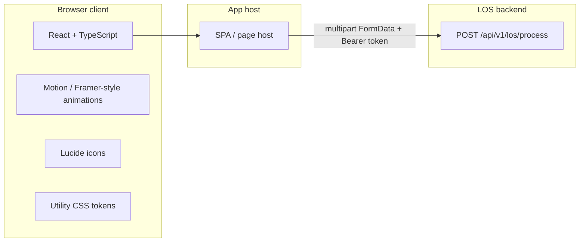
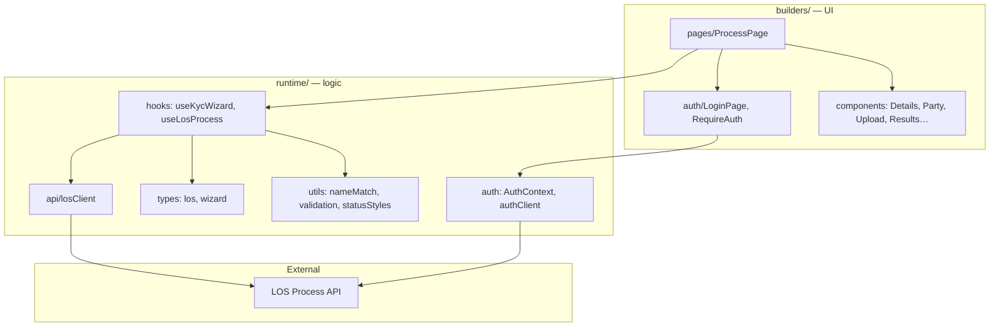
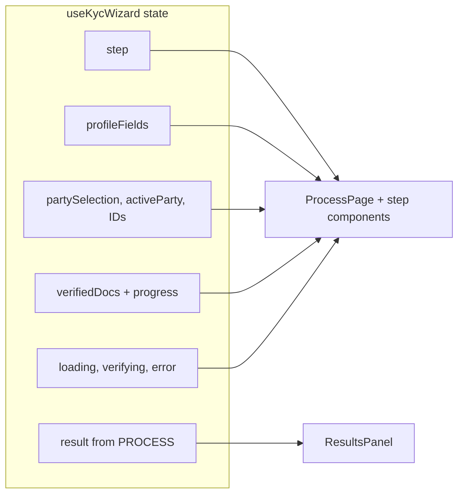
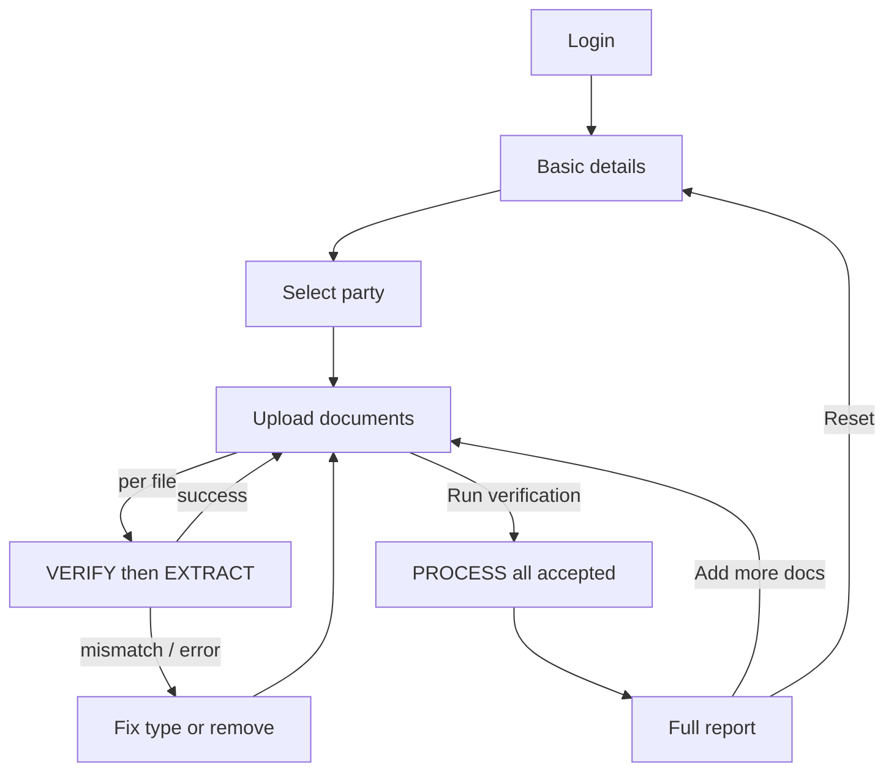
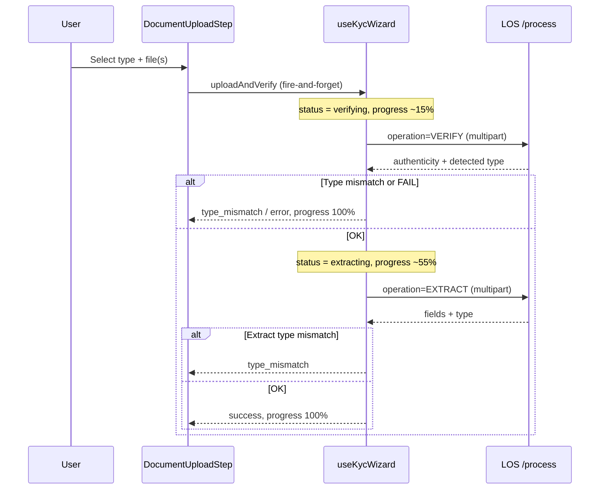
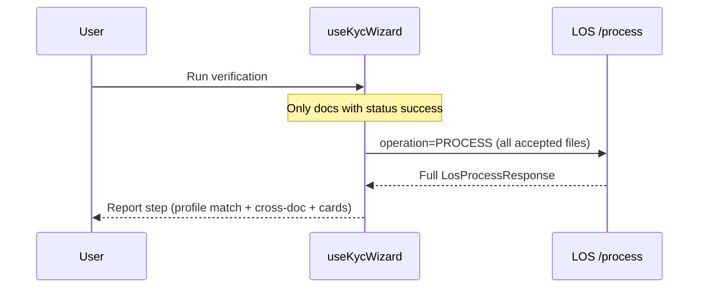
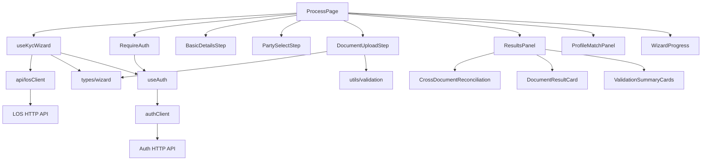
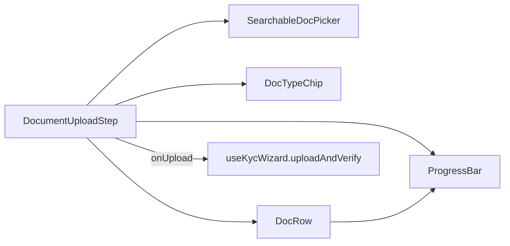
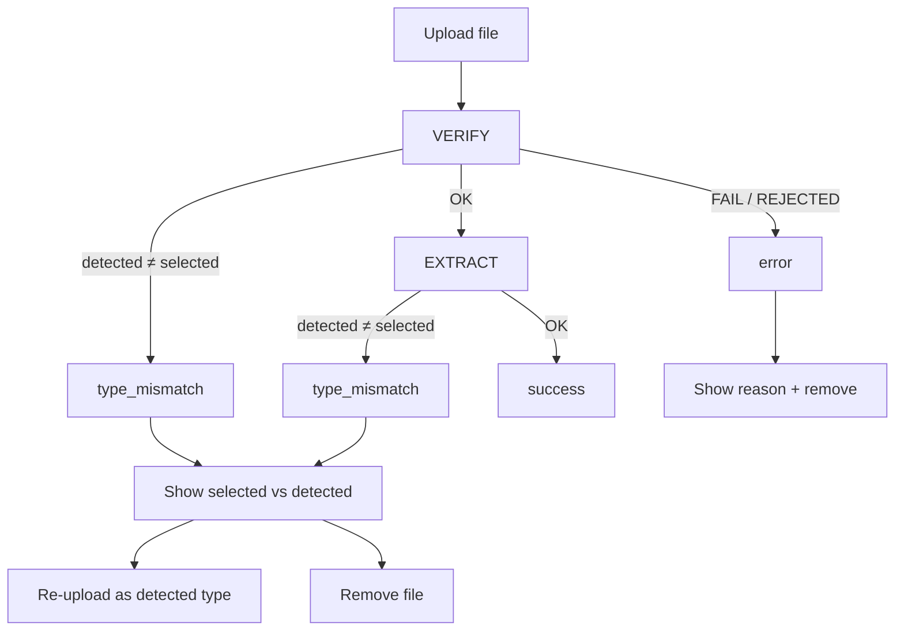

# KYC Document Verification

A guided web flow for **Know Your Customer (KYC)** checks. Users enter profile details, choose applicant / co-applicant, upload identity and income documents, and receive a full verification report.

The app talks to a **LOS (Loan Origination System) Process API**. Each file is checked for authenticity (**VERIFY**), then fields are read (**EXTRACT**). A final **PROCESS** run builds the full report, profile match, and cross-document checks.

---

## Table of contents

1. [What this product does](#1-what-this-product-does)
2. [Terms (simple glossary)](#2-terms-simple-glossary)
3. [Technology stack](#3-technology-stack)
4. [Architecture overview (ARD)](#4-architecture-overview-ard)
5. [User flow](#5-user-flow)
6. [Document pipeline](#6-document-pipeline)
7. [Features implemented](#7-features-implemented)
8. [Folder structure](#8-folder-structure)
9. [Dependency map](#9-dependency-map)
10. [API contract](#10-api-contract)
11. [Document types catalogue](#11-document-types-catalogue)
12. [Error and type-mismatch handling](#12-error-and-type-mismatch-handling)
13. [Performance notes](#13-performance-notes)
14. [How to run (integration)](#14-how-to-run-integration)

---

## 1. What this product does

| Step | What the user does | What the system does |
|------|--------------------|----------------------|
| Login | Signs in | Stores access token |
| Basic details | Enters name, DOB, PAN (and optional fields) | Validates required name |
| Party | Picks Applicant, Co-applicant, or both | Sets party roles and IDs |
| Documents | Chooses type → uploads file(s) | Runs VERIFY then EXTRACT per file |
| Run verification | Clicks once when docs are ready | Runs PROCESS on all accepted files |
| Report | Reviews results | Profile match, cross-doc checks, document cards |

**Design goals**

- Clear, production-ready UI (not a prototype look)
- Parallel uploads (do not wait for one file to finish)
- Selected document type must match what the system detects
- Simple English labels; safe error messages; recovery actions

---

## 2. Terms (simple glossary)

| Term | Meaning |
|------|---------|
| **KYC** | Know Your Customer — identity and document checks |
| **LOS** | Loan Origination System — backend that processes documents |
| **VERIFY** | API operation: is the document real / authentic? |
| **EXTRACT** | API operation: read fields (name, DOB, PAN, address, …) |
| **PROCESS** | API operation: full multi-doc report + cross checks |
| **Party** | Person in the case: Primary Applicant or Co-applicant |
| **Document type hint** | Type the user selects (e.g. PAN, Aadhaar, Driving License) |
| **Detected type** | Type the system thinks the file is |
| **Type mismatch** | Selected type ≠ detected type → file is rejected |
| **Profile match** | Compare user-entered profile fields to extracted data |
| **Cross-document reconciliation** | Compare the same field across multiple documents |
| **Wizard** | Step-by-step UI: details → party → documents → report |
| **ARD** | Architecture overview for this module (layers, decisions, data flow) |

---

## 3. Technology stack



| Layer | Choice | Why |
|-------|--------|-----|
| UI library | React | Component model, hooks, industry standard |
| Language | TypeScript | Safe types for API and wizard state |
| Animation | `motion/react` | Step transitions, lightweight motion |
| Icons | `lucide-react` | Consistent icon set |
| Styling | Design tokens (`ember`, `success`, `danger`, …) | Production look, not ad-hoc CSS |
| HTTP | `fetch` + `FormData` | Multipart file upload to LOS |
| Auth | Bearer token via `useAuth` / `RequireAuth` | Protect the process page |

---

## 4. Architecture overview (ARD)

### 4.1 Layering

The codebase splits into **builders** (screens/components) and **runtime** (API, hooks, types, utils). UI never calls `fetch` directly for LOS; it goes through the runtime client and hooks.



### 4.2 Architecture decisions

| Decision | Choice | Rationale |
|----------|--------|-----------|
| A1 | Wizard in one hook (`useKycWizard`) | Single source of truth for step, docs, errors |
| A2 | VERIFY then EXTRACT per file | Matches product rule: authenticity before releasing fields |
| A3 | PROCESS only on “Run verification” | Full report after user confirms accepted docs |
| A4 | Parallel uploads, no queue lock | Faster; each file owns its own chain |
| A5 | Reject on type mismatch | Selected type must match system detection |
| A6 | `builders` vs `runtime` split | UI can swap; API/types stay stable |
| A7 | Store extract response on success | Enough for UI; full truth comes from PROCESS |

### 4.3 State ownership



---

## 5. User flow



**Steps in the UI**

1. **Basic details** — name (required), DOB, PAN, optional custom fields  
2. **Party** — Applicant and/or Co-applicant  
3. **Documents** — pick type, upload one or many files, see progress %  
4. **Report** — status chips, profile match, cross-document reconciliation, per-doc cards  

---

## 6. Document pipeline

### 6.1 Per-file path (on upload)



### 6.2 Final report path



### 6.3 Progress model

| Stage | Typical progress | UI label |
|-------|------------------|----------|
| Start VERIFY | ~15% | VERIFY… |
| Start EXTRACT | ~55% | EXTRACT… |
| Success / error / mismatch | 100% | OK · type / error text |

---

## 7. Features implemented

### Auth

- Login page  
- `RequireAuth` gate on process flow  
- Bearer token on LOS requests  
- 401 → logout  

### Wizard

- Step indicator (`WizardProgress`)  
- Basic details with built-in + custom profile fields  
- Party select (Applicant / Co-applicant / both)  
- Switch active party when both are selected  

### Document upload

- Categories: Age, Signature, Identity, Address, Income, Property, Business, Other  
- Searchable type picker  
- Multi-file select for the same type  
- **Parallel uploads** (each file independent)  
- Progress bar + percentage per file  
- Cross-category highlight when a type is already done (e.g. PAN in Signature and Identity)  
- “Covered” badge on categories with at least one success  
- Type match on VERIFY and EXTRACT  
- Mismatch UI: selected vs detected, **Re-upload as {detected type}**, Remove  
- Co-applicant prompt after first party succeeds  

### Report

- Validation summary cards  
- Profile match panel  
- Cross-document reconciliation  
- Document result cards + preview modal  
- Status chips (PASS / REVIEW / FAIL, …)  

### Reliability

- Clear error messages  
- Type-mismatch builder with human labels  
- Accepted files only go into PROCESS  
- Parallel-safe state updates (`findIndex` patch, `idsRef` for concurrent calls)  

---

## 8. Folder structure

```text
src/
├── builders/                    # UI screens and presentational components
│   ├── api-tester/
│   │   ├── pages/
│   │   │   └── ProcessPage.tsx  # Main KYC wizard page
│   │   └── components/
│   │       ├── BasicDetailsStep.tsx
│   │       ├── PartySelectStep.tsx
│   │       ├── DocumentUploadStep.tsx
│   │       ├── ProfileMatchPanel.tsx
│   │       ├── ResultsPanel.tsx
│   │       ├── CrossDocumentReconciliation.tsx
│   │       ├── DocumentResultCard.tsx
│   │       ├── DocumentPreviewModal.tsx
│   │       ├── WizardProgress.tsx
│   │       └── …
│   └── auth/
│       ├── LoginPage.tsx
│       └── RequireAuth.tsx
│
└── runtime/                     # Logic, API, types (no layout chrome)
    ├── api-tester/
    │   ├── api/
    │   │   └── losClient.ts     # processDocuments()
    │   ├── hooks/
    │   │   ├── useKycWizard.ts  # Wizard state + upload chain
    │   │   └── useLosProcess.ts
    │   ├── types/
    │   │   ├── los.ts           # API types, DocumentTypeHint
    │   │   └── wizard.ts        # DOC_CATEGORIES, match helpers
    │   └── utils/
    │       ├── nameMatch.ts
    │       ├── validation.ts
    │       └── statusStyles.ts
    └── auth/
        ├── AuthContext.tsx
        ├── authClient.ts
        └── useAuth.ts
```

---

## 9. Dependency map

### 9.1 Module dependencies



### 9.2 Document upload component internals



---

## 10. API contract

**Endpoint:** `POST /api/v1/los/process`  
**Auth:** `Authorization: Bearer <token>`  
**Body:** `multipart/form-data`

| Field | Role |
|-------|------|
| `operation` | `VERIFY` \| `EXTRACT` \| `PROCESS` |
| `files` | Primary applicant files |
| `expected_types` | One type per primary file (same order) |
| `co_applicant_files` | Co-applicant files |
| `co_applicant_expected_types` | One type per co file |
| `applicant_id` | Optional case party id |
| `co_applicant_id` | Required if co files present |
| `case_id` | Optional case id |

**Client helper:** `processDocuments(params)` in `runtime/api-tester/api/losClient.ts`.

**Accepted file extensions:** `.pdf,.jpg,.jpeg,.png,.tif,.tiff,.webp`

---

## 11. Document types catalogue

Grouped in `DOC_CATEGORIES` (`types/wizard.ts`):

| Category | Examples |
|----------|----------|
| Age Proof | Aadhaar, Voter ID |
| Signature Verification | Bank Sign, PAN, Driving License, Passport |
| Identity Proof | PAN, ID Proof |
| Address Proof | Aadhaar, Driving License |
| Income Proof | ITR, Bank Statement, Salary Slip |
| Property Ownership | Sale Deed |
| Business Photographs | Business Proof 1 / 2 |
| Other | Other document (`AUTO`) |

Same logical type (e.g. **PAN**) can appear in more than one category. After a successful PAN upload, **all PAN chips** are highlighted so the user sees coverage at a glance.

---

## 12. Error and type-mismatch handling



- Mismatch messages use human labels (`formatDocTypeLabel`, `buildTypeMismatchError`).  
- Mismatched files never enter **PROCESS**.  
- **Re-upload as …** removes the bad row and opens the file picker for the detected type.

---

## 13. Performance notes

| Topic | Behaviour |
|-------|-----------|
| Parallel uploads | Multiple files run VERIFY→EXTRACT at the same time |
| Multi-select | One type → many files → each call is independent |
| UI updates | Few paints per file (start → extract → done) |
| List patches | Update one row by index, not full map every time |
| Memo | `DocRow` and `DocTypeChip` use `React.memo` |
| Network cost | Still **two uploads per file** (VERIFY + EXTRACT) until API offers a combined op |

**Tips for users**

1. Choose the **correct type** before selecting files.  
2. Upload **several documents in parallel**; do not wait for one to finish.  
3. Prefer smaller PDFs / compressed images when possible.

---

## 14. How to run (integration)

This package is the **KYC / LOS process UI module**. Wire it into the host app as follows:

1. Provide auth context so `useAuth` returns an access token.  
2. Mount `ProcessPage` behind `RequireAuth` (or your own gate).  
3. Ensure the host proxies or serves `POST /api/v1/los/process` per the contract above.  
4. Keep design tokens and global button classes (`.btn`, `.card`, colour tokens) available so the UI matches the rest of the product.

**Main entry for the flow**

```ts
import { ProcessPage } from './builders/api-tester/pages'
// or from the package barrel exports used by your app
```

**Core hook**

```ts
import { useKycWizard } from './runtime/api-tester'
```

---

## Quick reference — key files

| Concern | File |
|---------|------|
| Wizard orchestration | `src/runtime/api-tester/hooks/useKycWizard.ts` |
| LOS HTTP client | `src/runtime/api-tester/api/losClient.ts` |
| Types + catalogue + match helpers | `src/runtime/api-tester/types/wizard.ts`, `los.ts` |
| Upload UI | `src/builders/api-tester/components/DocumentUploadStep.tsx` |
| Report UI | `src/builders/api-tester/components/ResultsPanel.tsx` |
| Cross-doc checks UI | `src/builders/api-tester/components/CrossDocumentReconciliation.tsx` |
| Page shell | `src/builders/api-tester/pages/ProcessPage.tsx` |

---

## Summary

This module is a **production-oriented KYC verification wizard**: login-protected, multi-party, parallel document uploads with VERIFY → EXTRACT, strict type matching, progress feedback, and a full PROCESS report with profile and cross-document reconciliation. Architecture keeps **UI (builders)** separate from **API and state (runtime)**, with typed contracts aligned to the LOS multipart process API.
