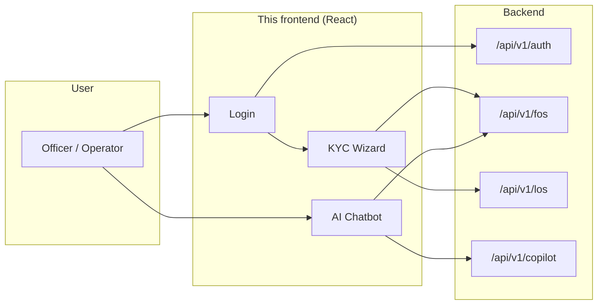
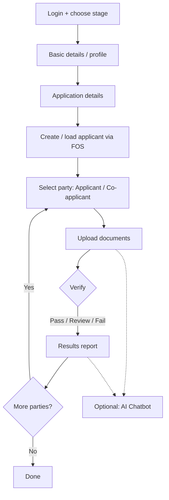
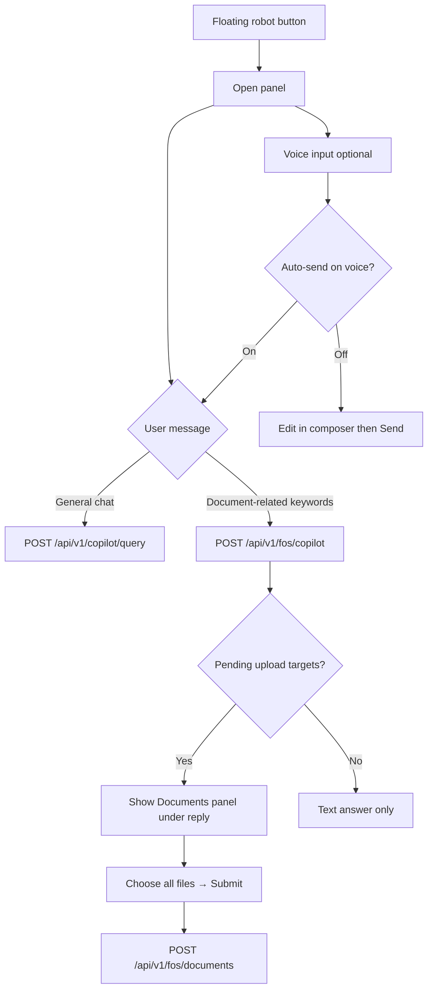
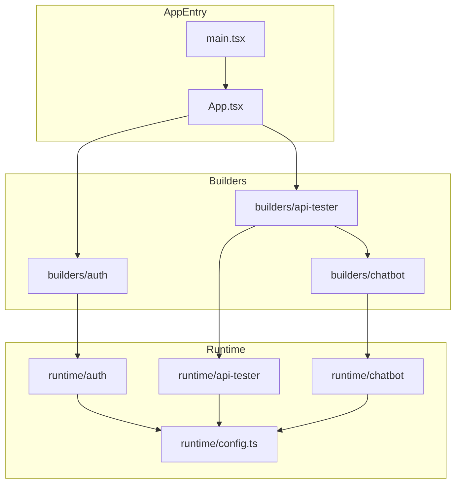
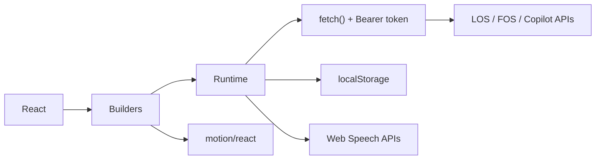
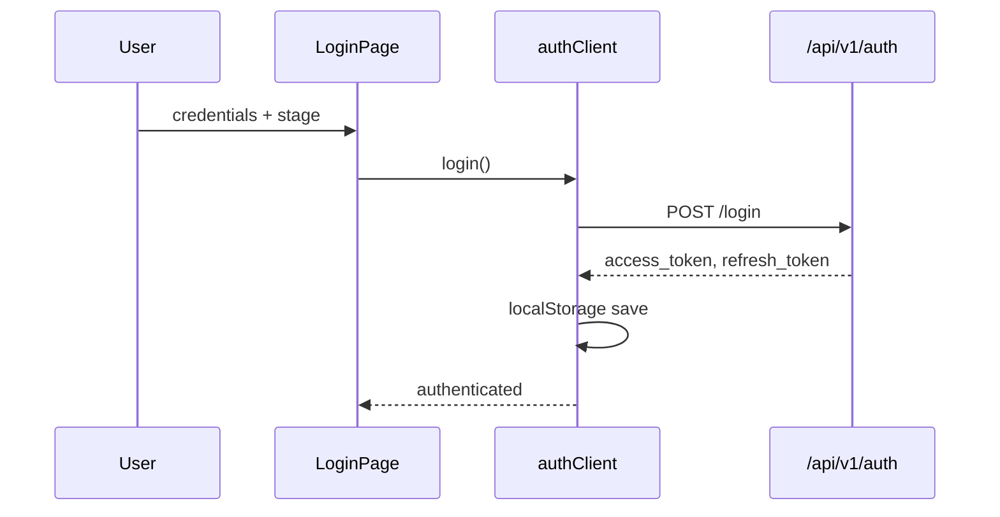
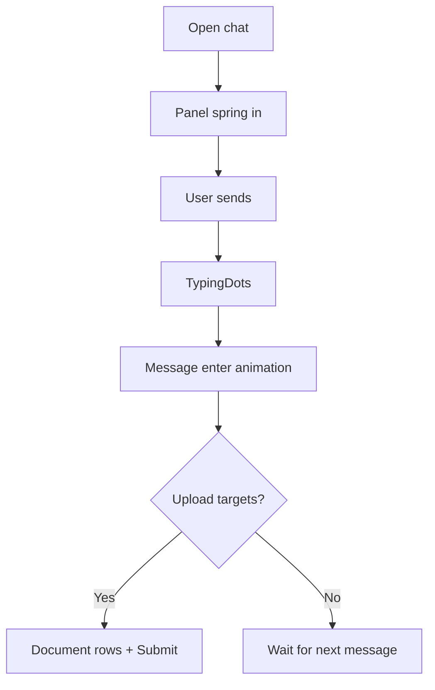

# LOS Frontend

English documentation for the **Loan Origination System (LOS) Process** frontend — document verification, authentication, and the portable AI chatbot.

Written for **two audiences**:

| Audience | What you’ll get |
|----------|-----------------|
| **Non-developers** (product, ops, QA) | What the app does, user journeys, screens, glossary |
| **Developers** | Folder layout, libraries, data flow, APIs, env vars, how to extend |

---

## Table of contents

1. [What this product is](#1-what-this-product-is)
2. [Who uses it (personas)](#2-who-uses-it-personas)
3. [User journeys](#3-user-journeys)
4. [Architecture overview](#4-architecture-overview)
5. [Folder structure](#5-folder-structure)
6. [Tech stack & dependencies](#6-tech-stack--dependencies)
7. [Module deep-dives](#7-module-deep-dives)
8. [Chatbot UI / UX & animation](#8-chatbot-ui--ux--animation)
9. [API & configuration](#9-api--configuration)
10. [State, storage & security](#10-state-storage--security)
11. [Chatbot portable package](#11-chatbot-portable-package)
12. [Hardcoded vs configurable](#12-hardcoded-vs-configurable)
13. [Local development](#13-local-development)
14. [QA checklist](#14-qa-checklist)
15. [Glossary](#15-glossary)
16. [Quick reference](#16-quick-reference)

---

## 1. What this product is

The frontend is a **web app** used during loan processing to:

1. **Sign in** with a role/stage (FOS, CPA, HOPS, BOPS, Credit).
2. **Capture applicant & application details**.
3. **Upload and verify KYC / income / address documents**.
4. **See verification results** (pass / review / fail).
5. **Ask an AI assistant** about the case (pending docs, mandatory list, status).

It talks to backend APIs for auth, FOS applicants, document verify/extract, and copilot Q&A.


```mermaid
flowchart LR
  subgraph User
    U[Officer / Operator]
  end
  subgraph Frontend["This frontend (React)"]
    Login[Login]
    Wizard[KYC Wizard]
    Chat[AI Chatbot]
  end
  subgraph Backend
    Auth["/api/v1/auth"]
    FOS["/api/v1/fos"]
    LOS["/api/v1/los"]
    Copilot["/api/v1/copilot"]
  end
  U --> Login --> Wizard
  U --> Chat
  Login --> Auth
  Wizard --> FOS
  Wizard --> LOS
  Chat --> Copilot
  Chat --> FOS
```

---

## 2. Who uses it (personas)

| Persona | Goal |
|---------|------|
| **FOS officer** | Collect applicant data, upload docs, chase pending documents |
| **CPA / Credit / other stages** | Same shell; stage is selected at login and sent with APIs |
| **Developer** | Run locally, wire env, port chatbot into another host app |
| **QA** | Walk wizard + chatbot flows, check upload rules, speech, and motion |

---

## 3. User journeys

### 3.1 Main process (wizard)


```mermaid
flowchart TD
  A[Login + choose stage] --> B[Basic details / profile]
  B --> C[Application details]
  C --> D[Create / load applicant via FOS]
  D --> E[Select party: Applicant / Co-applicant]
  E --> F[Upload documents]
  F --> G{Verify}
  G -->|Pass / Review / Fail| H[Results report]
  H --> I{More parties?}
  I -->|Yes| E
  I -->|No| J[Done]
  F -.-> K[Optional: AI Chatbot]
  H -.-> K
```

**Document rules (product behavior):**

- Upload UI shows only **backend-listed pending documents** (never an empty “0 documents” panel).
- Required rows show a **red `*`** (not the word “Required”).
- **No type dropdown** — type is inferred / sent as slot or first accepted type.
- **Submit** is enabled only when **every** pending mandatory file is chosen.

### 3.2 Chatbot journey


```mermaid
flowchart TD
  R[Floating robot button] --> O[Open panel]
  O --> Q{User message}
  Q -->|General chat| G["POST /api/v1/copilot/query"]
  Q -->|Document-related keywords| F["POST /api/v1/fos/copilot"]
  F --> U{Pending upload targets?}
  U -->|Yes| P[Show Documents panel under reply]
  U -->|No| T[Text answer only]
  P --> S[Choose all files → Submit]
  S --> D["POST /api/v1/fos/documents"]
  O --> V[Voice input optional]
  V --> AS{Auto-send on voice?}
  AS -->|On| Q
  AS -->|Off| Edit[Edit in composer then Send]
```

**Voice settings (Settings screen):**

- Voice input, auto-read replies, **auto-send when speech ends**
- Language list = **only languages this browser has TTS voices for** (Indian locale candidates filtered by installed voices)
- Gender, speed, chat theme (light / dark / orange)
- Suggested questions & timestamps toggles

---

## 4. Architecture overview

The code is split into two layers:

| Layer | Path | Responsibility |
|-------|------|----------------|
| **Builders** | `src/builders/*` | UI pages & components (what the user sees) |
| **Runtime** | `src/runtime/*` | Hooks, API clients, types, storage, business logic |


```mermaid
flowchart TB
  subgraph AppEntry
    main[main.tsx]
    App[App.tsx]
  end
  subgraph Builders
    authUI[builders/auth]
    wizardUI[builders/api-tester]
    chatUI[builders/chatbot]
  end
  subgraph Runtime
    authRT[runtime/auth]
    wizardRT[runtime/api-tester]
    chatRT[runtime/chatbot]
    cfg[runtime/config.ts]
  end
  main --> App
  App --> authUI
  App --> wizardUI
  wizardUI --> chatUI
  authUI --> authRT
  wizardUI --> wizardRT
  chatUI --> chatRT
  authRT --> cfg
  wizardRT --> cfg
  chatRT --> cfg
```

**Design rule:** UI does not call HTTP directly. Components call **hooks** (`useAuth`, `useKycWizard`, `useChatbot`); hooks call **API modules**.

---

## 5. Folder structure

```text
src/
├── main.tsx                 # React root
├── App.tsx                  # Shell: theme, auth gate, process page
├── index.css                # Tailwind v4 + design tokens (Ink & Ember)
├── vite-env.d.ts
│
├── builders/                # UI only
│   ├── auth/
│   │   ├── LoginPage.tsx
│   │   └── RequireAuth.tsx
│   ├── api-tester/          # KYC / LOS process wizard UI
│   │   ├── pages/ProcessPage.tsx
│   │   └── components/      # Steps, results, chips, modals
│   └── chatbot/             # Portable chatbot UI
│       ├── pages/Chatbot.tsx
│       └── components/
│           ├── ChatPanel.tsx
│           ├── ChatHeader.tsx
│           ├── ChatMessages.tsx
│           ├── MessageBubble.tsx
│           ├── TypingDots.tsx
│           ├── ChatComposer.tsx
│           ├── QuickActions.tsx
│           ├── DocumentUploadPanel.tsx
│           ├── Settings.tsx
│           ├── ConfirmModal.tsx
│           ├── RobotButton.tsx
│           └── ChatThemeStyles.tsx
│
└── runtime/                 # Logic + APIs
    ├── config.ts            # API base URL, paths, feature flags
    ├── auth/                # Tokens, context, login/refresh/logout
    ├── api-tester/          # Wizard state, FOS/LOS clients, validation
    └── chatbot/
        ├── hooks/useChatbot.ts
        ├── api/             # queryChat, fosCopilot, uploads
        ├── types/
        └── utils/           # speech, storage, translate, uploadTargets
```

---

## 6. Tech stack & dependencies

### Core

| Library | Role |
|---------|------|
| **React 18+** | UI components |
| **TypeScript** | Types across builders + runtime |
| **Vite** | Dev server & build |
| **Tailwind CSS v4** | Utility styling (`@import "tailwindcss"`, `@theme` tokens) |
| **lucide-react** | Icons |
| **motion** (`motion/react`) | Panel, messages, modal, typing, FAB animations |
| **@google/model-viewer** | 3D robot floating action button (optional GLB) |

### Browser APIs (no extra npm)

| API | Used for |
|-----|----------|
| **Web Speech API** (`SpeechRecognition`) | Voice input (Chrome / Edge preferred) |
| **speechSynthesis** | Text-to-speech (read aloud, auto-read) |
| **localStorage** | Auth tokens, theme, chat history, settings, FAB position |


```mermaid
flowchart LR
  React --> Builders
  Builders --> Runtime
  Builders --> Motion[motion/react]
  Runtime --> Fetch["fetch() + Bearer token"]
  Runtime --> LS[localStorage]
  Runtime --> Speech[Web Speech APIs]
  Fetch --> Backend[LOS / FOS / Copilot APIs]
```

---

## 7. Module deep-dives

### 7.1 Auth (`builders/auth` + `runtime/auth`)

- Login collects username, password, and **stage** (FOS / CPA / HOPS / BOPS / CREDIT).
- Tokens stored in **localStorage** (access + refresh).
- `AuthProvider` wraps the app; `RequireAuth` protects the process page.


```mermaid
sequenceDiagram
  participant U as User
  participant UI as LoginPage
  participant A as authClient
  participant API as /api/v1/auth
  U->>UI: credentials + stage
  UI->>A: login()
  A->>API: POST /login
  API-->>A: access_token, refresh_token
  A->>A: localStorage save
  A-->>UI: authenticated
```

### 7.2 KYC wizard (`builders/api-tester` + `runtime/api-tester`)

Orchestrated by **`useKycWizard`**: Basic details → Application → Party → Documents → Results.

Document pipeline convention:

- **VERIFY** then **EXTRACT**
- Skip **EXTRACT** on REVIEW / REJECT
- Run verification only after success docs where required

### 7.3 Chatbot (`builders/chatbot` + `runtime/chatbot`)

| Piece | File | Role |
|-------|------|------|
| Entry | `pages/Chatbot.tsx` | `useChatbot` → Robot + Panel |
| State | `hooks/useChatbot.ts` | Send, regenerate, edit, voice, upload |
| General Q&A | `api/client.ts` | `POST .../copilot/query` |
| Doc-aware Q&A | `api/fosCopilot.ts` | `POST .../fos/copilot` + keyword routing |
| Upload targets | `utils/uploadTargets.ts` | Structured fields only |
| Speech | `utils/speech.ts` | Voices, language list, TTS |
| Persist | `utils/storage.ts` | Debounced history + settings |

**Important behaviors:**

- **Regenerate** removes only the assistant reply and re-queries with `skipUserMessage` (no duplicate user bubble).
- **Long text** wraps via `min-w-0`, `break-words`, `overflow-wrap: anywhere`.
- **Upload panel** mounts only when `uploadTargets.length > 0`.

---

## 8. Chatbot UI / UX & animation

All motion uses **`motion/react`** and respects **`prefers-reduced-motion`**.

| Area | Behavior |
|------|----------|
| Panel open/close | Soft spring; mobile slides up; desktop scales slightly |
| Backdrop | Fade + light blur; click to close (expanded/mobile) |
| Settings ↔ chat | Horizontal soft spring swap |
| Recent messages | Last ~4 messages fade/slide in |
| Thinking / streaming | Shared **`TypingDots`** component (soft pulse; static if reduced motion) |
| Scroll-to-bottom | Fade + scale button |
| Empty state | Staggered title + quick-action cards |
| Confirm modal | Fade overlay + scale dialog; click outside cancels |
| Composer focus | Border + soft ring transition |
| Suggested chips | Hover shadow; slight active scale |
| Robot FAB | Spring show/hide; optional float when motion allowed |


```mermaid
flowchart TB
  Open[Open chat] --> Panel[Panel spring in]
  Panel --> Msg[User sends]
  Msg --> Think[TypingDots]
  Think --> Reply[Message enter animation]
  Reply --> Docs{Upload targets?}
  Docs -->|Yes| UploadUI[Document rows + Submit]
  Docs -->|No| Idle[Wait for next message]
```

---

## 9. API & configuration

Central config: **`src/runtime/config.ts`**.

| Constant / env | Meaning |
|----------------|---------|
| `VITE_API_BASE_URL` | API origin (empty = same-origin) |
| `VITE_ENABLE_CLIENT_TRANSLATE` | Optional MyMemory TTS translate (off by default) |
| `VITE_CHAT_TRANSLATE_PATH` | Preferred server translate path |
| `PATHS.authLogin` | `/api/v1/auth/login` |
| `PATHS.fos` | `/api/v1/fos` |
| `PATHS.los` | `/api/v1/los` |
| `PATHS.copilot` | `/api/v1/copilot` |
| `PATHS.copilotQuery` | `/query` |

### Chat routing rule

```text
IF message matches document keywords (pan, kyc, upload, pending, …)
   AND caseId + applicantId present
THEN  POST /api/v1/fos/copilot
ELSE  POST /api/v1/copilot/query
```

Keywords: `runtime/chatbot/api/fosCopilot.ts` → `isDocumentRelatedQuery()`.

---

## 10. State, storage & security

| Data | Where | Notes |
|------|-------|-------|
| Access / refresh tokens | localStorage | Auth runtime |
| App theme | `los-theme` | App shell |
| Chat settings | `chatbot.settings.v1` | Theme, voice, language, … |
| Chat conversations | `chatbot.conversations.v1` | Debounced 400ms; max 40 / 80 msgs |
| FAB position | `chatbot-fab-pos` | Draggable robot |
| Wizard draft | wizard storage util | Resume mid-flow |

- Prefer **HTTPS** (mic + some APIs need secure context).
- Client third-party translate is **off by default**.
- Upload UI is driven only by **structured API fields**, not answer text.

---

## 11. Chatbot portable package

1. Copy **`builders/chatbot`** + **`runtime/chatbot`** (and needed bits of `runtime/config.ts`).
2. Pass props:

```tsx
<Chatbot
  caseId="..."
  applicantId="..."
  partyId="..."
  stage="FOS"
  accessToken={token}
  apiBaseUrl="https://api.example.com"
  apiQueryPath="/query"
  modelUrl="/robot.glb"
/>
```

3. Host needs React, Tailwind tokens (or mapped classes), `lucide-react`, `motion`, and optionally `@google/model-viewer`.

---

## 12. Hardcoded vs configurable

### Configurable

- API base URL and translate flags (env)
- Case context & token (props)
- User settings (theme, voice, language, send-with-enter, timestamps, suggestions, auto-send on voice)

### Hardcoded (change in code)

| Area | Examples |
|------|----------|
| Quick actions | “How can you help?”, “Check application status”, … |
| Doc routing keywords | pan, aadhaar, kyc, upload, pending, … |
| Upload codes | `DOCUMENT_MISSING`, `UPLOAD_DOCUMENT`, … |
| File limits | 25 MB; PDF/JPG/PNG/… accept list |
| Speech candidates | Indian BCP-47 list (**filtered** by browser voices at runtime) |
| Storage caps | 40 conversations, 80 messages, 400ms debounce |
| Branding copy | “AI Assistant”, status labels, empty-state text |

---

## 13. Local development

```bash
npm install
npm run dev
npm run build
```

**Env example (`.env.local`):**

```bash
VITE_API_BASE_URL=https://your-api.example.com
# VITE_ENABLE_CLIENT_TRANSLATE=true   # demo only
# VITE_CHAT_TRANSLATE_PATH=/api/v1/copilot/translate
```

**Browser tips:**

- Voice input works best in Chromium.
- Allow microphone when testing auto-send on voice.
- Language dropdown only lists TTS languages **installed on that machine**.
- OS “reduce motion” simplifies chatbot animations.

---

## 14. QA checklist

### Wizard

- [ ] Login with each stage persists and is available to APIs  
- [ ] Cannot skip steps without required fields  
- [ ] Document verify/extract matches REVIEW/REJECT rules  
- [ ] Co-applicant flow continues after primary  

### Chatbot

- [ ] Long unbroken text wraps inside bubbles  
- [ ] Regenerate does **not** duplicate the user question  
- [ ] Documents panel hidden when zero pending targets  
- [ ] Submit disabled until **all** mandatory files chosen  
- [ ] No type dropdown on document rows  
- [ ] Auto-send on voice (when enabled) sends once after speech ends  
- [ ] Language dropdown only shows browser-supported voices  
- [ ] Suggested questions / timestamps respect Settings  
- [ ] Panel / thinking / scroll animations feel smooth  
- [ ] With reduced-motion OS setting, animations simplify  

---

## 15. Glossary

| Term | Meaning |
|------|---------|
| **FOS** | Front Office System APIs (applicant, checklist, documents, copilot) |
| **LOS** | Loan Origination System (process / verification APIs) |
| **Copilot** | AI query service for case Q&A |
| **Stage** | Role context at login: FOS, CPA, HOPS, BOPS, CREDIT |
| **Upload target** | Pending document slot from structured API data |
| **Builders** | UI layer folders |
| **Runtime** | Logic, hooks, and API clients |
| **TypingDots** | Shared loading indicator for thinking / streaming |

---

## 16. Quick reference

| Need | Open this |
|------|-----------|
| Env / API paths | `src/runtime/config.ts` |
| Auth tokens & stages | `src/runtime/auth/*` |
| Wizard state machine | `src/runtime/api-tester/hooks/useKycWizard.ts` |
| Chat state machine | `src/runtime/chatbot/hooks/useChatbot.ts` |
| Doc upload UI | `src/builders/chatbot/components/DocumentUploadPanel.tsx` |
| Message bubbles | `src/builders/chatbot/components/MessageBubble.tsx` |
| Typing indicator | `src/builders/chatbot/components/TypingDots.tsx` |
| Chat settings UI | `src/builders/chatbot/components/Settings.tsx` |
| Speech / languages | `src/runtime/chatbot/utils/speech.ts` |
| Upload target rules | `src/runtime/chatbot/utils/uploadTargets.ts` |
| Design tokens | `src/index.css` |
| This document | `README.md` |

---

*Keep this file updated when APIs, wizard steps, or chatbot UX change.*
